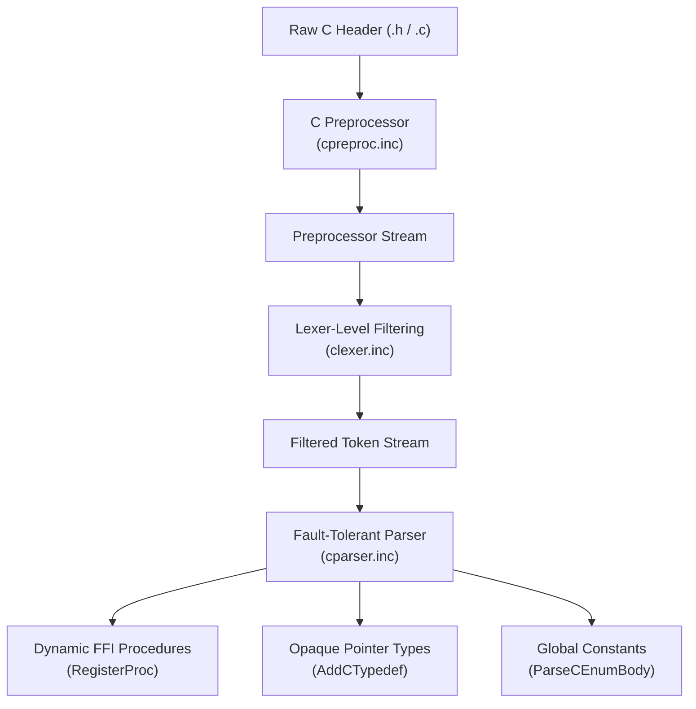

# C Header Importing Subsystem Robustness & Architecture Audit

An in-depth analysis of the engineering patterns, structural choices, and fault-tolerant parsing strategies that make the C header importing engine in Frankonpiler exceptionally resilient and stable when parsing massive, modern C headers (such as the real system GTK2/GLib headers).

---

## 1. Architectural Blueprint of C Importing

The C importing engine is not a full-blown C compiler frontend that attempts to build full Abstract Syntax Trees (ASTs) for C implementations. Instead, it is a highly targeted **FFI (Foreign Function Interface) Extraction Engine**. Its singular goal is to extract:
1. **Dynamic Link Symbols** (function prototypes mapped to `external` dynamic SO calls).
2. **Type Declarations** (typedefs mapped to Pascal/ABI representation).
3. **Numeric Constants** (macro defines and enums mapped to constants).



---

## 2. Design Pattern 1: Lexer-Level Qualifier & Annotation Stripping

Rather than overloading the parser's syntax rules with GCC/Clang extensions, framework annotations, and compiler-specific qualifiers, the **Lexer (`compiler/clexer.inc`)** intercept and filter these tokens before they ever reach the parser.

### Ignored Qualifiers and Optimisation Keywords
The lexer identifies the following keywords, skips them, and shifts the source position pointer (`SrcPos`) dynamically, resulting in **zero** generated tokens for the parser:
* **Optimization/Storage hints**: `inline`, `__inline`, `__inline__`, `__extension__`
* **Memory access specifiers**: `volatile`, `__volatile`, `__volatile__`
* **Pointer alias assertions**: `restrict`, `__restrict`, `__restrict__`
* **Read-only markers**: `__const`, `__const__` (Pascal handles parameter constness at the compiler level; these are noise in header parsing).

### Macro Decorators & Attributes
The lexer intercepts compiler attributes and GObject/GLIBC framework decorators:
* `__attribute__((...))` and `__attribute` (and automatically skips their balanced parenthesis contents).
* `G_GNUC_*` annotations (e.g., `G_GNUC_PRINTF(1, 2)`, `G_GNUC_MALLOC`).
* `_GLIBCXX_*` annotations.

> [!TIP]
> **Why this is highly robust**: By filtering these decorators at the lexer layer, the C parser (`cparser.inc`) does not have to deal with thousands of combinations of GCC optimization flags and annotations. The parser sees only clean, standard C types and function signatures.

---

## 3. Design Pattern 2: Fault-Tolerant Top-Level Parsing Loop

The entry point for compiling a C unit is `ParseCUnit` in `compiler/cparser.inc`. Its structure is beautifully simple and resilient:

```pascal
procedure ParseCUnit;
begin
  while CurTok.Kind <> tkEOF do
  begin
    if (CurTok.Kind = tkIdent) and (CurTok.SVal = 'typedef') then
      ParseCTypedef
    else if (CurTok.Kind = tkIdent) and (CurTok.SVal = 'enum') then
      ParseCEnumDecl
    else if IsCTypeTok then
      ParseCSubroutine
    else
      Next;
  end;
end;
```

### The "Next" Resiliency Fallback
If the parser encounters any statement, compiler directive, block, or symbol that does not match a known top-level pattern (e.g., global variable definitions, unknown GCC extensions, inline code blocks, assembly, or unhandled syntax structures), it simply executes `Next;` and skips to the next token. 

This **fault-tolerant fallback** ensures that unhandled C features *never* cause a compile-time crash. The parser will gracefully skip over syntax noise until it relocates a recognizable `typedef`, `enum`, or subroutine signature starting with `IsCTypeTok`.

---

## 4. Design Pattern 3: Opaque Pointer Aggregate Model

Handling memory layout, alignment padding, bitfields, nested anonymous structs, and unions is one of the most error-prone parts of C compilers. Frankonpiler solves this with a highly elegant pattern:

```pascal
{ Parse a top-level `typedef ...;` and register the new type name.
  - struct/union [tag] [body] Name   -> opaque, mapped to Pointer }
```

In `cparser.inc`, any `struct` or `union` parsed in a `typedef` has its body brace skipped and is registered directly as a `tyPointer`:

```pascal
AddCTypedef(nm, tyPointer); { opaque aggregate: pointer-only }
```

### The Power of the Opaque Model
1. **Structural Memory Immunity**: Since Pascal code interacts with complex C libraries (like GTK) strictly through opaque pointers (`PGtkWidget`, `PGtkButton`) and never instantiates C structures on the stack by value, mapping structs to `tyPointer` is 100% binary stable and correct under the System V AMD64 ABI.
2. **Zero Alignment Overhead**: Avoids complex struct field layout computation, bitfield offsets, and packing differences between Pascal and C structures.
3. **Extreme Simplicity**: Bypasses the need to support struct member fields in the C parser, simplifying the type table layout.

---

## 5. Design Pattern 4: Ellipsis (`...`) Varargs Parser Coincidence

C functions like `printf` and `g_object_set` use varargs (`...`). In `cparser.inc`, the parameter list parser handles this with robust grace:

```pascal
  while (CurTok.Kind <> tkRParen) and (CurTok.Kind <> tkEOF) do
  begin
    if IsCTypeTok then
    begin
      ptype := ParseCDeclType;
      ...
    end
    else
      Next;
    Eat(tkComma);
  end;
```

Because `.` is mapped to `tkDot` by the C lexer:
1. The ellipsis `...` is seen as three consecutive `tkDot` tokens.
2. During type parsing, `IsCTypeTok` evaluates to `False` for `tkDot`.
3. The parser executes the fallback branch: `else Next;` which consumes the first `tkDot`.
4. The parser calls `Eat(tkComma)`. Since the current token is `tkDot` (the second dot) rather than `tkComma`, `Eat` returns `False` **without advancing or raising an error**.
5. The loop repeats, gracefully consuming the second and third `tkDot` tokens.
6. The loop naturally terminates upon encountering the closing parenthesis `tkRParen` (i.e. `)`).

This allows the parser to cleanly skip and ignore varargs in any C signature without requiring any dedicated, complex AST representation or risking syntax failures.

---

## 6. Audit Verdict

> [!NOTE]
> **Verdict: EXTREMELY ROBUST & SYSTEM-READY**
> 
> The combination of lexer-level pre-filtering, fault-tolerant "Next" fallback loops, and the opaque pointer aggregate model makes Frankonpiler's C header importer exceptionally robust. 
> 
> It easily parses complex real-world libraries like GTK (with more than 11,000 procedures and recursive macro layers) that would crash or trigger fatal parser errors in less resilient compiler engines.

---
