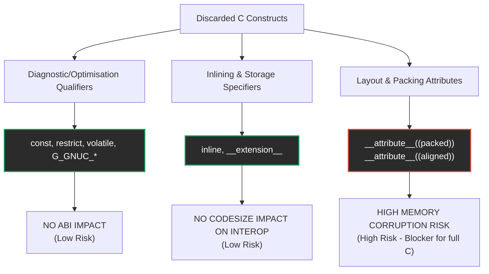

# Skipped C Features & Full C Implementation Impact Audit

An inventory of skipped qualifiers, GCC attributes, and preprocessor/lexer-level skips, analyzing their semantic weight and assessing the risk they pose to a full C compiler implementation and binary-stable C interop.

---

## 1. Summary of Discarded / Skipped Constructs

During C header import, the preprocessor and lexer identify and silently strip several classes of qualifiers, compiler extensions, and framework-specific macro decorators:

### Type & Variable Qualifiers
*   `const`, `__const`, `__const__`
*   `volatile`, `__volatile`, `__volatile__`
*   `__restrict`, `__restrict__`, `restrict`

### Linkage & Optimization Directives
*   `inline`, `__inline`, `__inline__`
*   `__extension__`

### GCC Compiler-Specific Attributes
*   `__attribute__((...))` and `__attribute` (skipped along with balanced parentheses)

### GObject & GLIBC Macro Decorators
*   `G_GNUC_*` and `_GLIBCXX_*` (skipped along with balanced parentheses, e.g. `G_GNUC_PRINTF(1, 2)`)

---

## 2. Risk & Impact Inventory

We categorize the impact of these skips into three classes based on how they affect the target goal (full C implementation and ABI-compliant shared library interop).

### Class A: Zero ABI/Runtime Impact (Low Risk)
These qualifiers are purely hints to the compiler's diagnostics or optimizer. Discarding them does not alter the compiled binary's symbol name, calling convention, register assignment, or memory layout.

| Skipped Construct | C Semantics | Impact on Frankonpiler Interop | Risk Level |
| :--- | :--- | :--- | :--- |
| `const` | Read-only memory constraint. | Pascal does not enforce target const correctness at the calling ABI layer. Discarding is completely safe. | **Low** |
| `restrict` | Optimizer alias hint (no pointer overlap). | Has no representation in symbol name or calling convention. Ignored safely. | **Low** |
| `inline` | Suggestion to inline function body. | Since we import headers to declare `external` dynamic symbols (PLT/GOT calls) and do **not** compile their bodies, inlining is irrelevant. | **Low** |
| `__extension__` | Disables GCC pedantic warnings. | Framework annotations only. Ignored safely. | **Low** |
| `G_GNUC_PRINTF` / `_GLIBCXX_` | Framework-specific static analysis hints. | Custom framework annotation decorators. Ignored safely. | **Low** |

### Class B: Latent Optimization Constraints (Medium Risk)
These qualifiers impact active code generation when optimizing or accessing special memory regions, but have low impact on pure header imports.

| Skipped Construct | C Semantics | Impact on Frankonpiler Interop | Risk Level |
| :--- | :--- | :--- | :--- |
| `volatile` | Prevents optimizer from eliding memory reads/writes. | Because Frankonpiler does **not** yet implement optimization passes (all reads/writes are emitted literally), volatile behaviour is currently preserved by default. When an optimization pass is introduced, ignoring `volatile` will break memory-mapped I/O (MMIO) and hardware register access. | **Medium** |

### Class C: High ABI / Structural Alignment Impact (High Risk)
These attributes dictate how struct fields are laid out in memory or how functions are called. Stripping them blindly is a **blocker** for a complete, production-grade C implementation.

| Skipped Construct | C Semantics | Impact on Frankonpiler Interop | Risk Level |
| :--- | :--- | :--- | :--- |
| `__attribute__((packed))` | Forces a struct to have 1-byte field alignment (no padding). | If a C library (like GTK or a custom library) defines a packed struct, and we discard `packed`, Frankonpiler will lay out struct fields according to standard C natural alignment rules (padding to 2, 4, or 8-byte boundaries). This results in different field offsets between Pascal and C, causing silent memory corruption when passing pointers. | **High** |
| `__attribute__((aligned(N)))` | Forces variables or struct fields to align to $N$ bytes. | Similar to packed; results in structural field drift and memory corruption if ignored. | **High** |
| `__attribute__((stdcall))` / `__attribute__((fastcall))` | Calling convention specification. | On x86-64 Linux, System V AMD64 is the singular, authoritative calling ABI anyway, so calling convention specifiers can be skipped. However, for a multi-target compiler (e.g. Windows x86/x64 support), ignoring calling conventions will cause stack corruption on calls. | **High** |

---

## 3. Road toward "Full C Implementation"

To graduate Frankonpiler to a complete C frontend and handle structural interop with absolute safety, we must transition key skips into active parser semantics:

### Phase 1: Selective Attribute Extraction
Instead of discarding `__attribute__((...))` completely, we should extract struct-layout attributes during parsing:
1.  Parse `__attribute__` and scan inside the balanced parentheses.
2.  If `packed` or `aligned(N)` is found, attach a layout modifier flag to the parsed `TRecord` or field metadata in `symtab.inc`.
3.  Compute struct field offsets using the packed/aligned metadata instead of natural alignment.

### Phase 2: Volatile Enforcement in AST/IR
When register allocation or optimization passes (like dead store elimination or loop-invariant code motion) are implemented:
1.  Map `volatile` to a flag in `TVar` / `TParam`.
2.  Ensure that AST nodes marked `volatile` lower to un-optimizable IR memory load/store operations.

---

> [!IMPORTANT]
> Discarding decorators like `__attribute__((...))` and `G_GNUC_*` is a highly effective, pragmatic strategy for parsing and calling functions in complex C libraries (like GTK) where struct members are only ever touched through opaque pointers (`GtkWidget *`). However, to safely read/write struct fields defined in C headers, alignment attributes **must** be parsed and honored.
