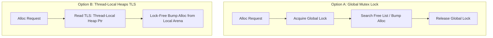

# Threading & Heap Allocation Design Proposal

> Historical design exploration. The implemented baseline and active ordered
> plan now live in [`threads-todo.md`](threads-todo.md). Statements below about
> the current implementation are not authoritative.

This document outlines the architectural roadmap for introducing thread safety, locking, and memory allocation control to the Frankonpiler (PXX dialect) without compromising its core system programming performance or "zero external dependencies" philosophy.

---

## 1. Architectural Strategy: Zero-Overhead Threading

To prevent monothreaded programs from paying any performance overhead for thread safety, the compiler will support a compile-time option and directive:

*   **Compiler Option**: `--threadsafe`
*   **Source Directive**: `{$THREADSAFE ON}` / `{$THREADSAFE OFF}` (defaults to `OFF`).

When `--threadsafe` or `{$THREADSAFE ON}` is **inactive**, the compiler generates identical high-performance, single-threaded inline instructions for memory allocation and reference counting. When **active**, the code generator inserts atomic locks and operations *only* at specific interaction boundaries.

---

## 2. Dynamic Reference Counting (Dynamic Arrays)

Dynamic arrays are currently reference-counted via standard `INC` and `DEC` operations. Under multiple threads, concurrent modifications will lead to race conditions.

### The Lock-Free Atomicity Solution
Instead of using slow mutexes for reference counting, we can utilize x86-64 hardware-level **bus-locking** prefixes. This ensures high-performance, thread-safe, lock-free reference counting:

*   **Monothreaded Codegen**:
    ```assembly
    inc qword [rax]   ; Standard increment
    ```
*   **Threadsafe Codegen**:
    ```assembly
    lock inc qword [rax] ; Hardware atomic increment
    ```

Using the `LOCK` prefix on `INC` and `DEC` operations provides thread-safe atomicity with zero system call overhead and absolute minimal hardware cost.

---

## 3. Thread-Safe Heap Allocator Design

The heap allocator currently bump-allocates and threads freed blocks through a single global free list (`BSS_FREE_LIST`) and heap boundary (`HEAP_PTR` / `HEAP_END`). 

To make this thread-safe, we have three distinct options, each catering to different levels of complexity and performance:



### Option A: Global Mutex / Spinlock (Recommended for Phase 1)
*   **Design**: Protect `GetMem`, `FreeMem`, and `ReallocMem` code segments behind a global heap lock.
*   **Zero Dependencies Implementation**: Instead of linking against external libraries (like `libpthread.so`), we can implement a highly efficient **User-space Spinlock** directly in our code generator using the atomic `XCHG` instruction:
    *   **Acquire Lock**:
        ```assembly
        .acquire:
          mov eax, 1
          lock xchg [HeapLock], eax
          test eax, eax
          jnz .acquire      ; Spin if lock was already held
        ```
    *   **Release Lock**:
        ```assembly
        mov qword [HeapLock], 0
        ```
*   **Pros**: Extremely simple to emit, self-contained, high performance for low-contention thread states.
*   **Cons**: Under heavy multi-threaded allocation loads, threads will experience lock contention.

### Option B: Thread-Local Allocation Heaps via TLS (Option for Phase 2)
*   **Design**: Store the thread-local allocation bounds (`HEAP_PTR` and `HEAP_END`) in **Thread Local Storage (TLS)** using segment registers (e.g. `FS` or `GS` segment prefixes).
*   **Implementation**: On Linux x86-64, the `FS` segment register points to the thread control block. We can allocate a thread-local block at thread creation and access local bump pointers lock-free:
    ```assembly
    mov rbx, [fs:0x10]  ; Read thread-local HEAP_PTR
    ```
*   **Pros**: 100% lock-free heap allocation for all threads! Zero lock contention.
*   **Cons**: Deallocating a block allocated by thread A inside thread B requires a thread-safe global routing free-list or a thread-safe slab allocator, which increases complexity.

---

## 4. Code Generator Implementation

To ensure that the code generator (`compiler/ir_codegen.inc`) remains clean, maintainable, and unified, we will encapsulate lock generation inside helper procedures:

```pascal
procedure EmitAcquireHeapLock;
begin
  if ThreadSafeMode then
  begin
    { Emit spinlock acquire: mov eax, 1; lock xchg [HeapLock], eax; test eax, eax; jnz ... }
  end;
end;

procedure EmitReleaseHeapLock;
begin
  if ThreadSafeMode then
  begin
    { Emit spinlock release: mov qword [HeapLock], 0 }
  end;
end;
```

This abstracts locking away from the allocator logic. The `GetMem` emission block remains simple and readable:

```pascal
EmitAcquireHeapLock;
{ ... existing first-fit free list search and bump allocation ... }
EmitReleaseHeapLock;
```

---

## 5. Next Actionable Steps

1.  **Introduce `--threadsafe` & `{$THREADSAFE}`**: Add the global `ThreadSafeMode: Boolean` setting to `defs.inc` and wire it up to options/directives.
2.  **Atomic Reference Counting**: Modify dynamic-array reference count modification points in `ir_codegen.inc` to prepend `LOCK` instructions when `ThreadSafeMode` is active.
3.  **User-space Spinlock Variable**: Register a `HeapLock` variable in the BSS/Data section.
4.  **Locking implementation in Allocator**: Inject `EmitAcquireHeapLock` and `EmitReleaseHeapLock` wrappers inside `tkGetMem`, `tkFreeMem`, and `ReallocMem` codegen blocks.
5.  **Multi-threaded Testing**: Add a test `test/test_multithreading.pas` that spawns multiple threads via `pthread_create` to concurrently allocate memory and manipulate dynamic arrays.
