# Examples

A showcase of programs PXX compiles today: small Pascal demos, terminal and GUI
applications, Python (NilPy) programs, ESP32 firmware, and real third-party C
code such as BusyBox, SQLite, zlib and Lua. The sources for the demos live
under `examples/` in the checkout.

**Every entry on this page was compiled and run.** Nothing is listed on the
strength of a test that once passed or a claim in another document.

> **Verified 2026-09-24** on an x86-64 Linux host, with the pinned compiler
> **v423** (`stable_linux_amd64/default/pinned`, sha256 `113a515bbdc9…`), at
> checkout `02bd18fa0`. Where a row was measured differently, it says so. A
> later pin may behave differently in either direction; re-run a command to
> check.
>
> **Re-checked 2026-09-25 with pin v424** (commit `0a3a7b5b4`, sha256
> `93a336a7ba85…`). All 36 example programs built. The batch and parallel
> programs printed output byte-identical to v423's, apart from timing figures,
> and every binary is the same size as under v423. The screenshots, the ESP
> runs and the C-library rows were not redone for v424.
>
> **Re-checked 2026-09-25 with pin v425** (commit `4fbf33f69`, sha256
> `426b2fbf3f08…`). The 20 batch and parallel programs printed output
> byte-identical to v424's, apart from timing figures, and each binary is the
> same size. The C and Pascal library rows, the ESP QEMU runs and the ESP32-S3
> board walk were re-run with v425, and each says so. The screenshots were not
> redone for v425.

## Quick start

```sh
./install.sh --yes      # checks the pinned compiler, writes the ./pxx wrapper
./demos.sh list         # the launcher's menu
./demos.sh all          # build every demo, run the batch ones
```

On the verification host `./demos.sh all` reported
`27 built, 0 failed (12 batch ran; tty/gui built-only)`. `make demos` builds
the complete set of 36 programs under `examples/` (esp32 excluded), and all 36
built.

To build one program yourself:

```sh
./pxx examples/json/jsondemo.pas /tmp/jsondemo
/tmp/jsondemo
```

Programs that use `parallel for` need `--threadsafe`, and the compiler refuses
them without it:

```sh
./pxx --threadsafe examples/parallel/primecount.pas /tmp/primecount
```

PXX writes its own ELF executables and needs no external linker. Programs that
don't use a system GUI library come out as a single static file with no
dynamic loader, and the hello-world is **4,544 bytes**. The GTK, OpenGL and
SDL2 programs below link those system libraries dynamically.

## Pascal: batch programs

Each of these runs to completion and checks its own result. The ones marked
**ALL OK** compare against built-in expected values and print a verdict.

| Program | Source | What it shows | Result on the verification run | Binary |
| --- | --- | --- | --- | --- |
| hello | `examples/hello/hello.pas` | The smallest program | `Greetings from PXX` | 4.4 KB |
| primes | `examples/primes/sieve.pas` | Bit-packed sieve of Eratosthenes | 78,498 primes ≤ 1,000,000 | 103 KB |
| sudoku | `examples/sudoku/sudoku.pas` | Backtracking solver | three puzzles solved | 29 KB |
| factorial | `examples/bignum/factorial.pas` | Big-integer factorial | 1000! has 2,568 digits | 107 KB |
| bigmath | `examples/bignum/bigmath.pas` | Arbitrary-precision arithmetic, modular power | ALL OK | 136 KB |
| json | `examples/json/jsondemo.pas` | JSON parse and emit, escapes, Unicode | ALL OK | 502 KB |
| sat | `examples/sat/satdemo.pas` | DPLL SAT solver, including pigeonhole UNSAT | ALL OK | 117 KB |
| mathf | `examples/mathf/mathdemo.pas` | Floating-point math library | every check `ok` | 187 KB |
| maze | `examples/maze/maze.pas` | Maze generation and solving | seeded maze with solved path | 106 KB |
| mandelbrot | `examples/mandelbrot/mandelbrot.pas` | ASCII Mandelbrot set | ALL OK (checksum) | 136 KB |
| raytracer | `examples/raytracer/raytracer.pas` | Ray tracer, headless | ALL OK (checksum) | 545 KB |
| vm | `examples/vm/vmdemo.pas` | Tiny bytecode VM and assembler | ALL OK | 123 KB |
| calc | `examples/calc/calcdemo.pas` | Expression evaluator, including rejects | ALL OK | 109 KB |
| lisp | `examples/lisp/lispdemo.pas` | Lisp with closures and a cell arena | ALL OK | 122 KB |
| httpdemo | `examples/net/httpdemo.pas` | HTTP server and client on one coroutine reactor (loopback, no network needed) | three requests, cookie and gzip | 593 KB |

The maze demo draws its own solution:

```text
#########################
#*#   #                 #
#*# ### ######### ##### #
#*#   # #*******#     # #
#*# # # #*#####*### # # #
#*# #   #*#***#***# # # #
#*##### #*#*#*###*### # #
#*****# #***#*# #***# # #
#####*# #####*# ###*# ###
#   #*#     #*#*****#   #
# ###*##### #*#*####### #
#*****#     #*#*#  ***# #
#*####### ###*#*###*#*# #
#*#*****# #***#*****#*# #
#*#*###*###*#########*# #
#***#  *****#        ***#
#########################
seed 12345  size 12x8  path cells = 49
```

The HTTP demo runs a server and a client in one process:

```text
GET /        -> 200 OK
  body:   Welcome to frank2 net
  cookie: sid=demo123
GET /me      -> 200 OK  (cookie sent back)
  body:   hello sid=demo123
GET /data.gz -> 200 OK  (gzip, decoded transparently)
  body:   hello world
done
```

## Pascal: parallel programs

`uses palparallel` gives `parallel for` loops with reductions and a choice of
work distribution. Build these with `--threadsafe`.

| Program | Source | What it shows |
| --- | --- | --- |
| primecount | `examples/parallel/primecount.pas` | Even load: prime count over 2..2,000,000 |
| collatz | `examples/parallel/collatz.pas` | Very uneven load, where on-demand distribution pays off |
| pow | `examples/parallel/pow.pas` | Compute-bound hashing, near-linear scaling |
| membw | `examples/parallel/membw.pas` | Memory-bound against compute-bound reduction |

Each program checks that every distribution produces the same answer as the
serial loop:

```text
Prime count over 2..2000000   workers=12
primes     = 148933   max gap = 132
serial     : 2951987 us
pdChunked  : 653334 us   speedup 451 /100x
pdOnDemand : 592328 us   speedup 498 /100x
(even load: pdChunked ~= pdOnDemand here, unlike collatz)
ALL AGREE — count matches pi(LIMIT), reductions identical across distributions
```

The timings come from a shared 12-core machine that was busy with other work,
so read the speedups as indicative only. The correctness line is the claim.

## Pascal: terminal applications

Full-screen terminal programs using PXX's own terminal units: no curses and no
C library. The screenshots were captured from each program running in an
`xterm`, driven by scripted keystrokes.

| Program | Source | |
| --- | --- | --- |
| 2048 | `examples/g2048/console_2048.pas` | 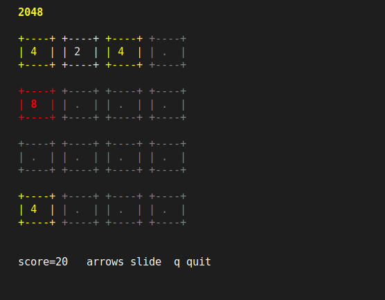 |
| Klondike solitaire | `examples/solitaire/console_solitaire.pas` (build with `-Fuexamples/solitaire_gui`, where its card engine lives; `./demos.sh` does this) | 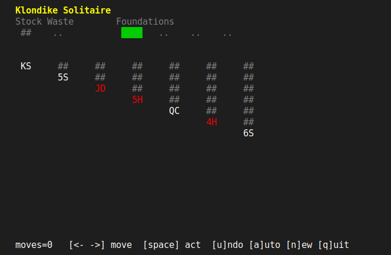 |
| Sudoku game | `examples/sudoku/sudoku_game.pas` | 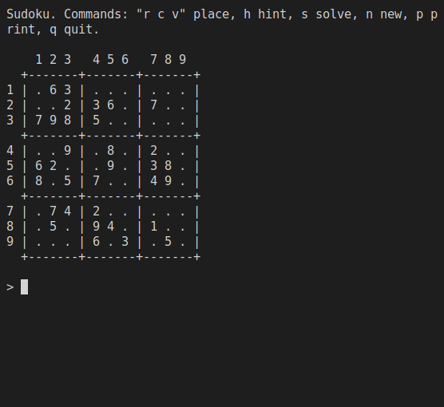 |
| Text adventure | `examples/adventure/adventure.pas` (run from `examples/adventure/`, it reads `world.dat`) | 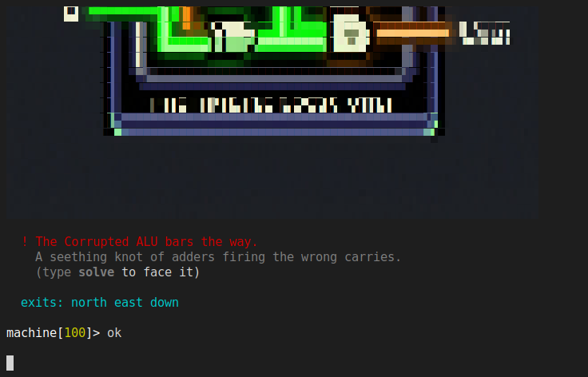 |
| Menu widgets | `examples/tui/menudemo.pas` | 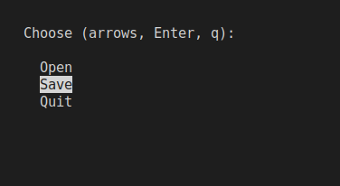 |
| File browser | `examples/fm/fm.pas` (`fm --interactive [path]`; with no flag it renders once and exits) | 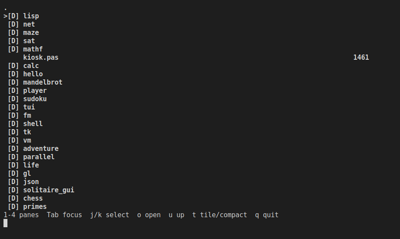 |
| Mandelbrot zoom | `examples/mandelbrot/mandelzoom.pas`: animated truecolor zoom using integer asm kernels on all cores (build with `--threadsafe`) | 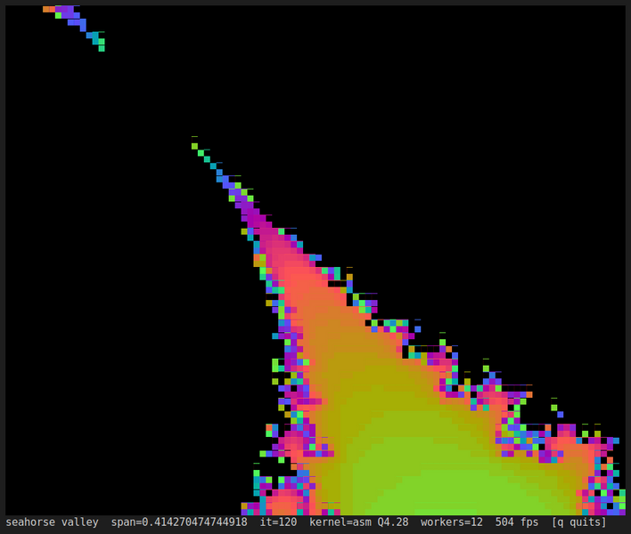 |
| Video player | `examples/player/player.pas`: `player <video>`, decodes through an `ffmpeg` child process and draws in truecolor blocks | 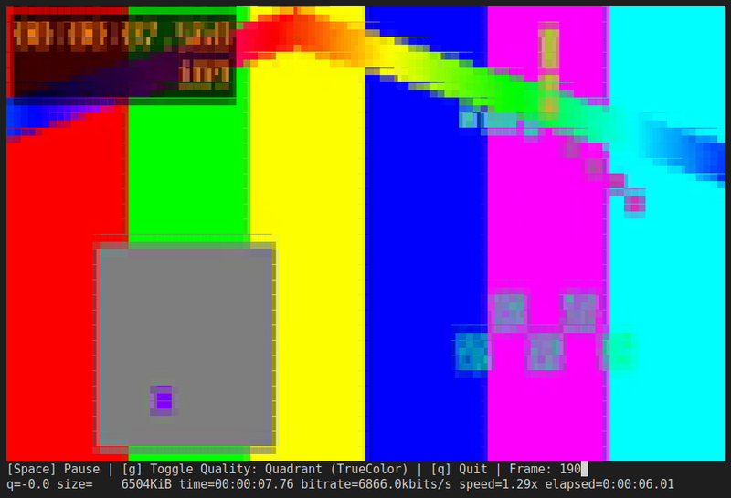 |

The chess engine (`examples/chess/chess.pas`) and the kiosk are
line-oriented, so they are shown as text. At start-up the engine prints the
board, its move-generation counts (perft), which match the published values
for the start position, and its opening choice. It then takes commands
(`print`, `fen`, `perft <n>`, `go <depth>`, `quit`):

```text
   a b c d e f g h
White to move

perft(1) = 20
perft(2) = 400
perft(3) = 8902
perft(4) = 197281

bestmove e2e4  score 10  nodes 40793
chess>
```

`examples/kiosk.pas` is the small program that runs inside the
[minimal Linux system](./minimal-linux-system.md):

```text
kiosk> about
pxx self-hosting Pascal compiler, static, no libc.
kiosk> sum 100
sum 1..100 = 5050
kiosk> primes 50
primes below 50 = 15
```

## Pascal: GUI applications

GTK 3 applications, two of them drawing with OpenGL. These need the GTK 3
development headers and libraries on the build host. The screenshots were
taken on a virtual X display with software OpenGL, so the render times and
frame rates shown inside them are not representative of a real GPU.

| Program | Source | |
| --- | --- | --- |
| OpenGL triangle | `examples/gl/triangle.pas` | 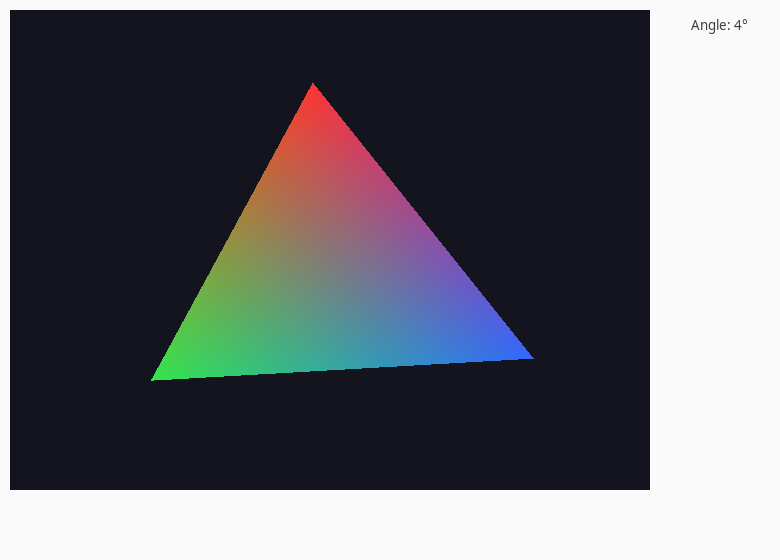 |
| Game of Life | `examples/life/life.pas` | 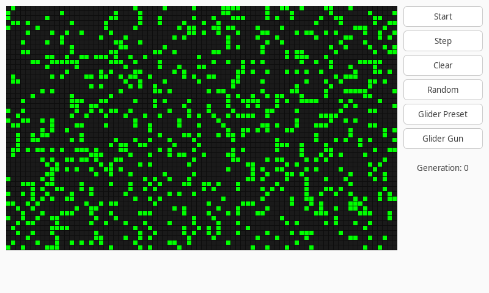 |
| Mandelbrot explorer | `examples/mandelbrot/mandelbrot_gui.pas`: drag to pan, click to zoom, rendered on every core | 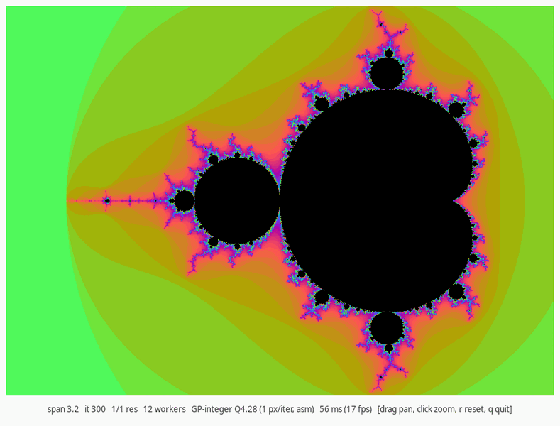 |
| Ray tracer | `examples/raytracer/raytracer_gui.pas`: reflective spheres, interactive camera | 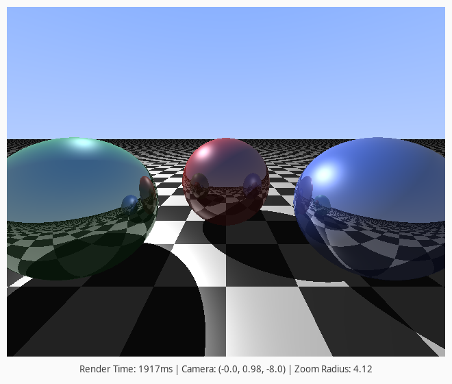 |
| Solitaire | `examples/solitaire_gui/solitaire_gui.pas` |  |

### The Eliah IDE

`apps/ide/` is a larger application built with PXX: a single-window IDE,
Lazarus- and Delphi-inspired but deliberately stripped down, with everything
tiled into one window. It is early work and the layout still shows it. It also
doubles as a real-world stress test for the compiler. It builds in about nine
seconds, and its headless core test reported `168 passed, 0 failed`.

```sh
apps/ide/build.sh       # builds apps/ide/eliah/eliah with the pinned compiler
apps/ide/test.sh        # the render-agnostic core, tested without any GUI
```

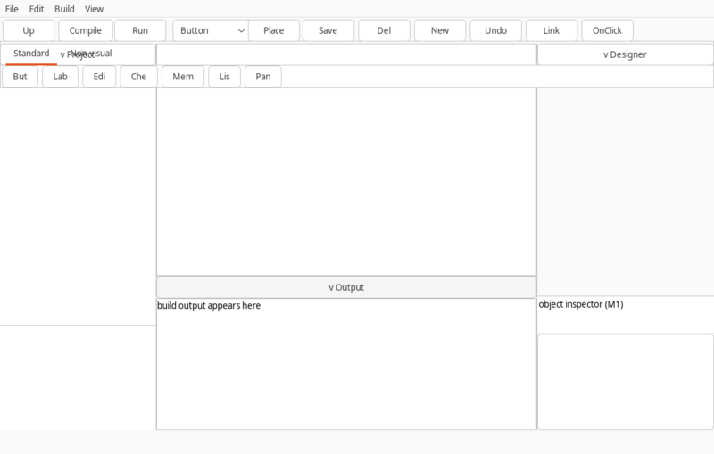

The components use a Hebrew naming scheme. Every name transliterates a word
tied to the prophet Elijah and the theme of testimony:

| Name | Hebrew | Meaning | Role |
| --- | --- | --- | --- |
| `garin` | גרעין | kernel / core | The render-agnostic engine: editor buffer, project model, the designed-form document and the builder. Both faces grow from this seed. |
| `eliah` | אליה | Elijah | The GTK face: the graphical IDE window. |
| `ilja` | איליה | Elijah | The ANSI/TUI face: the same prophet, a second face. |
| `bochan` | בוחן | examiner | The headless test driver for `garin`. It links no GUI or TUI face, which proves the core is render-agnostic. |
| `eduth` | עדות | testimony | The validator `bochan` reports to. It witnesses results, tallies pass and fail, and gives a verdict. |

## Python (NilPy)

NilPy is PXX's Python-shaped frontend. It compiles a static subset of Python
straight to machine code, with no interpreter at run time. Compatibility runs
one way: a program in the supported subset should give CPython's answers, and
NilPy also accepts some things CPython rejects. It is younger than the Pascal
frontend and has known gaps.

### nilsh: a BusyBox-style shell

`examples/shell/nilsh.npy` is a single binary whose commands are built-in
applet functions, with no fork and no exec. The same source is meant to run as
a Linux process or as an ESP32 task set. It plays a scripted session:

```sh
./pxx examples/shell/nilsh.npy /tmp/nilsh && /tmp/nilsh
```

```text
$ help
applets: echo cat ls wc head tail grep upper rev help
$ echo one two three | wc
1 3 13
$ echo nilsh | upper
NILSH
$ echo nilsh | rev
hslin
$ echo alpha beta | cat | upper
ALPHA BETA
```

### lekkerzeilen: a 3D sailing simulator

lekkerzeilen is a separate project: a boat simulator on the real Dutch rivers,
built from open elevation, building and waterway data and rendered with SDL2
and OpenGL. It is written in ordinary Python and runs under CPython through
`ctypes`. The **same source** compiles with PXX to a native binary that talks
to SDL2 and OpenGL directly. It compiles to about 11.6 MB of machine code with
one command, run from the PXX checkout with the lekkerzeilen checkout beside
it (lekkerzeilen's own `runbin.sh` does the same):

```sh
stable_linux_amd64/default/pinned --threadsafe \
    -dSDL_DISABLE_IMMINTRIN_H -dGL_GLEXT_PROTOTYPES \
    ../lekkerzeilen/lekkerzeilen/__main__.py ../lekkerzeilen/bin/lekkerzeilen
```

The binary looks for its `world/` data relative to its own location, so keep
it in the project's `bin/` directory.

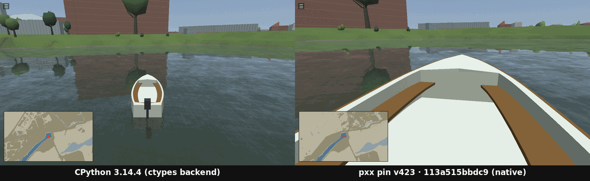

Both screenshots show the same built scene, the same launch and the same
1280×720 window. They were taken on 2026-09-24, from lekkerzeilen commit
`9db2e38` without changes, on the PXX side built with pin v423. Each is a
single frame captured shortly after start-up, which is why the camera views
differ.

**It compiles and runs. It is not yet as fast as CPython.** A frame rate there is
a property of the scene. The project's own measurement on the `world/roofs`
region (4 tiles), the scene the demo starts in, is **PXX 1.89 fps against
CPython 37.1 fps**: the median over 20-frame windows of 150-second runs, with
audio and vsync on, on one machine, one program at a time. Other scenes
behave very differently, and no other lekkerzeilen frame rate is current.
That measurement was taken by the
lekkerzeilen project on **pin v416**, not re-run for this page. That
measurement's own notes list compiler fixes that landed after v416, so a figure
from a later pin may differ. The gap is the work in progress; the result that stands is
that a large 3D Python application with sound builds into one native binary
and runs.

## ESP32

PXX cross-compiles to the ESP32-S3 (Xtensa) and the ESP32-C3 (RISC-V). A
program becomes a relocatable object that the normal ESP-IDF build links as
`app_main`. That includes a Python program, which becomes machine code on the
chip with no interpreter. The examples live in `examples/esp32/`, one ESP-IDF
project per program and chip. To build and flash one yourself, follow
[Getting started on the ESP32](../getting-started/esp32.md); the units they use
are documented in [ESP32 peripherals](../library/esp.md).

### A Python sensor monitor on an ESP32-S3

`examples/esp32/monitor-s3/main/main.npy` is a sensor monitor written in
Python and compiled to Xtensa machine code: there is no interpreter on the
chip. Once a second it:
- averages the ADC samples streamed in the background;
- keeps a short history in a list and its statistics in a dict;
- counts presses of the BOOT button;
- prints one line with the chip's own free heap.

The ADC and button interrupts are handled in Pascal (`espadc`, `espgpio`),
and the Python handlers run afterwards in the main task, so they are ordinary
code.

```python
import time
import interrupts
import 'espadc.pas' as adc
import 'espgpio.pas' as gpio
import 'espsys.pas' as sys

def on_button(ev):
    state["presses"] += 1
    print(f"button pressed ({state['presses']} so far)")

def main():
    interrupts.on_event(interrupts.INT_SRC_ADC, on_frame)
    interrupts.on_event(interrupts.INT_SRC_GPIO, on_button)
    gpio.gpio_input(BUTTON)
    gpio.on_falling(BUTTON)
    print("adc start", adc.start(ADC_CHANNEL, SAMPLE_HZ))
    for tick in range(1, REPORTS + 1):
        time.sleep(1)
        stats = summarize(collect())
        ...
        print(f"#{tick:3d} mean {stats['mean']:4d} range {stats['min']}..{stats['max']}"
              f" trend {trend:7s} frames {state['frames']} free {sys.free_heap()}")
```

Build and flash it with the ESP-IDF toolchain loaded
([Getting started on the ESP32](../getting-started/esp32.md) has the setup):

```sh
tools/esp_flash.sh --project examples/esp32/monitor-s3 --port /dev/ttyACM0 --no-verify --seconds 15
```

**The soak on the board.** It was run with `REPORTS` raised from 10 to 240 and
captured over serial for 262 seconds. It printed 193 reports, and the free heap
stayed between 257,948 and 262,072 bytes the whole time. It only switches
between those two values, depending on whether a buffer is in use at the
moment of the reading, and never drifts. These are the first reports as
captured, with nothing connected to the ADC pin, so the readings sit near the
top of the 12-bit range:

```text
I (523) main_task: Calling app_main()
adc start 0
#  1 mean 3861 range 3796..3882 trend flat    frames 16 free 258084
#  2 mean 3860 range 3836..3882 trend flat    frames 32 free 262068
#  3 mean 3859 range 3837..3879 trend flat    frames 48 free 262060
#  4 mean 3859 range 3838..3879 trend flat    frames 64 free 262068
#  5 mean 3859 range 3839..3878 trend flat    frames 80 free 262068
#  6 mean 3859 range 3839..3877 trend flat    frames 96 free 262072
#  7 mean 3859 range 3839..3878 trend flat    frames 112 free 257976
#  8 mean 3859 range 3837..3877 trend flat    frames 128 free 262056
#  9 mean 3860 range 3837..3880 trend flat    frames 144 free 262060
# 10 mean 3860 range 3839..3880 trend flat    frames 160 free 262060
```

The soak was measured on 2026-09-25 on an ESP32-S3 devkit (ESP-IDF v6.0.1,
160 MHz), with a compiler built after pin v424 (sha256 `29956ba5beff…`, tree
`9c14efd7b`). The checked-in example, with `REPORTS = 10`, also runs on the
board with pin v424 and with pin v425: on v425 its ten reports read an ADC mean
of 3861 to 3863 and free heap between 257,976 and 262,088 bytes. The raw
capture and the exact program are kept in the repository, in
[`devdocs/evidence/monitor-s3-soak-2026-09-25/`](https://github.com/yoctobyte/pxx/tree/master/devdocs/evidence/monitor-s3-soak-2026-09-25).

Nil Python is python-ish: this program stays inside the core that behaves as
CPython does, and outside it the language is known to have plenty of issues
(see [Nil Python](../targets/nil-python.md)).

### The other examples, under QEMU

For this page, each one below was **built with pin v425 and booted under
Espressif's QEMU** on 2026-09-25, as it was with v423 before. Its console output was checked against the program's
`main.expected` file or its own verdict line. They were not run on a physical
board for this page. The prerequisite is the ESP-IDF toolchain
(`. ~/esp/esp-idf/export.sh`).

| Example | Chip | Language | Command | Result |
| --- | --- | --- | --- | --- |
| hello | S3, C3 | Pascal | `tools/esp_run.sh --chip esp32s3 examples/esp32/hello-s3/main/main.pas` | prints its five lines and `sum 1..5 = 15` |
| nilpy-s3, nilpy-c3 | S3, C3 | Python | `cd examples/esp32/nilpy-s3 && ./build.sh qemu-assert` | output identical to CPython's |
| nilpy-hw-s3, nilpy-hw-c3 | S3, C3 | Python | `./build.sh qemu-assert` | GPIO and timer calls from Python match `main.expected` |
| isrctx-c3 | C3 | Pascal | `./build.sh qemu-assert` | task context and interrupt context both witnessed |
| timer-s3, timer-c3 | S3, C3 | Pascal | `./build.sh qemu` | five ticks, `status=0` |
| fs-c3 | C3 | Pascal | `./build.sh qemu` | FAT mount, write, seek and read back: `esp-pal-file-io-WORKS` |
| dns-c3 | C3 | Pascal | `./build.sh qemu` | lwIP resolver smoke test, `status=0` |
| net-c3 | C3 | Pascal | `./build.sh qemu` | network smoke test, `status=0` |
| gpio-c3 | C3 | Pascal | `./build.sh qemu` | GPIO configuration runs. QEMU delivers no input edges, and the program reports exactly that |

`tools/esp_run.sh` compiles with the in-tree compiler unless
`ESP_RUN_PXX="$PWD/stable_linux_amd64/default/pinned"` is set; the path must be
absolute, because the script compiles from inside the ESP-IDF project. The `build.sh`
scripts default to the pinned compiler.

The Python program from `nilpy-s3` is ordinary Python:

```python
class Boat:
    def __init__(self, name, speed):
        self.name = name
        self.speed = speed

    def eta(self, dist):
        return dist // self.speed

def main():
    fleet = [Boat("Aurora", 6), Boat("Wind", 8), Boat("Kees", 5)]
    total = 0
    for b in fleet:
        t = b.eta(120)
        total += t
        print(b.name, t)
    print("total", total, len(fleet))

main()
```

On the emulated ESP32-S3 it prints the same bytes CPython prints on a desktop:

```text
Aurora 20
Wind 15
Kees 24
total 59 3
```

### On a real ESP32-S3

The examples were also flashed to an ESP32-S3 devkit on 2026-09-24/25 with pin
v424, and again on 2026-09-25 with pin v425 (ESP-IDF v6.0.1). All fifteen
checks passed both times. The details are in
[Getting started on the ESP32](../getting-started/esp32.md#verified-with).

| Example | Language | Result on the board |
| --- | --- | --- |
| monitor-s3 | Python | the report lines above; free heap flat over 193 reports |
| nilpy-s3, nilpy-hw-s3 | Python | output matches `main.expected` byte for byte |
| gpio-edge-s3 | Pascal | output matches `main.expected`: real input edges, which QEMU cannot deliver |
| adc-s3 | Pascal | output matches `main.expected`: real ADC readings |
| hello-s3, timer-s3, rgb-s3, i2c-s3, pwm-s3, uart-s3, nvs-s3 | Pascal | each prints its own pass line |
| wifi-ap-s3 | Pascal | starts the access point and reaches `HTTP server listening on port 80`; no client connected during the test |

**Long-running use.** Re-run in a loop with v424, `nilpy-s3`, `nilpy-hw-s3`
and `gpio-edge-s3` lose about 44, 220 and 264 bytes per pass, and `adc-s3`
about 17 KB per pass, because an `adc.read()` whose result is thrown away is
not released. v425 carries the fixes for all of these. With a compiler that has
the first fixes (sha256 `29956ba5beff…`), the first three stay flat. With v425
itself, `adc-s3` looped 60 times keeps its free heap at 271,232 bytes from the
first pass to the last.

Still unverified: `adc-c3` and `gpio-edge-c3`, because there was no C3 board
and QEMU delivers no ADC readings or GPIO edges; and `hello-s2`, which builds
but has not been run. `tools/esp_flash.sh --project examples/esp32/<name>`
builds, flashes and checks an example on a board.

## Real C programs

PXX's C frontend compiles third-party C as released, together with PXX's own
C runtime (`lib/crtl`) in place of glibc. There is one exception. zlib is
built as a single translation unit, where one anonymous `typedef struct` would
be repeated, and that is invalid C, which GCC rejects too. So the recipe gives
that struct a tag in a copy of `gzguts.h`. Apart from tcc, the results below
are static executables with no dynamic loader and no external C library. The
sources are fetched on demand, not stored in the repository:

```sh
tools/install_lib_candidates.sh busybox sqlite zlib lua cjson duktape quickjs tcc tiny-regex-c enet
```

Every row was re-run on 2026-09-25 with **pin v425** (commit `4fbf33f69`,
compiler sha256 `426b2fbf3f08…`) at checkout `41a347978`. Each row says how
it was checked: against the recipe's expected output, against the same driver
program built by GCC and linked with glibc, or both. The binary sizes are for
builds without `-g`.

| Program | Version | How it was checked | Binary |
| --- | --- | --- | --- |
| **BusyBox**, unity build | 1.36.1 | `tools/busybox_diff.sh --pinned --targets x86_64`: applets `cat` and `echo` as one translation unit; output byte-identical to a GCC build over 29 cases | 171 KB |
| **BusyBox**, linked by PXX itself | same | `tools/busybox_diff.sh --pinned --pxx-link --targets x86_64 --applets "cat echo ls wc sort ash"`: 55 objects linked by `pascal26 --link` with no external linker; no `PT_INTERP`; byte-identical to GCC over 82 cases | 20 MB |
| **SQLite** | 3.46.0 | amalgamation plus a ten-line `sqlite3_exec` driver; the SQL session below | 3.2 MB |
| **zlib** | 1.3.1 | zlib's own `test/example.c`: output byte-identical to the same program built by GCC | 717 KB |
| **Lua** | 5.4.7 | the six `test/lua/*.lua` programs: all match the expected output, and all six outputs are byte-identical to the GCC build; the stock `lua.c` interpreter also builds and runs | 968 KB |
| **cJSON** | 1.7.18 | the five `test/cjson/*.json` documents round-trip: all match the expected output and the GCC build | 149 KB |
| **Duktape** | 2.7.0 | a JavaScript engine: `test/duktape/duk_smoke.c` runs a curated script, exits 42, and prints 29 lines byte-identical to the expected output and to the GCC build | 1.4 MB |
| **QuickJS** (quickjs-ng) | 0.9.0 | `./pxx -Ilib/crtl/include -Ilib/crtl/src -Ilibrary_candidates/quickjs test/quickjs/runner.c qjs` (about 11 s), then `./qjs "$(cat test/quickjs/smoke.js)"`: output byte-identical to `test/quickjs/smoke.expected`. | 4.9 MB |
| **tcc**, the Tiny C Compiler | mob `a338258d` | from the repository root, `./pxx -Ilibrary_candidates/tcc library_candidates/tcc/tcc.c tcc`. That tcc compiles a C program into the same executable, byte for byte, as a GCC-built tcc does, and compiles `tcc.c` into a tcc byte-identical to the one the GCC-built tcc produces, which then reproduces itself. It uses tcc's own build tree for `config.h` and `libtcc1.a`. Unlike the other rows it links glibc's `libc.so.6` dynamically. `tcc -run` needs a different build; see [Status](../reference/status.md) | 1.8 MB |
| **tiny-regex-c** | `f2632c6d` | its own three test programs, each built together with `re.c`: `test1` passes 76 of 76, and all three print the same as the GCC build. `test1` counts its test table with `sizeof a / sizeof *a`, which v424 got wrong | 102 KB (`test1`) |
| **ENet**, reliable UDP networking | 1.3.18 | its eight Unix `.c` files (all but `win32.c`) built as one unit with a 50-line driver in which a server and a client, in one process, connect over `127.0.0.1` and send one reliable packet each way: `result: connected=1 server=1 client=1`, output identical to the GCC build | 196 KB |

SQLite, compiled by PXX from the single-file amalgamation:

```sh
./pxx -DSQLITE_THREADSAFE=0 -Ilib/crtl/include -Ilib/crtl/src -Ilibrary_candidates/sqlite driver.c /tmp/sqlmini
/tmp/sqlmini "create table boats(id integer primary key, name text, knots real);
  insert into boats(name, knots) values ('Aurora', 6.5), ('Wind', 8.0), ('Kees', NULL);
  select * from boats;
  select count(*), avg(knots), group_concat(name) from boats;
  select sqlite_version();"
```

```text
1|Aurora|6.5
2|Wind|8.0
3|Kees|NULL
3|7.25|Aurora,Wind,Kees
3.46.0
```

Here `driver.c` is `#include "sqlite3.c"` plus a `main` that opens `:memory:`
and passes its argument to `sqlite3_exec`. `-DSQLITE_THREADSAFE=0` builds SQLite
without its own locking, which a single-threaded program does not need. Without
it, SQLite's mutexes use `<pthread.h>` and the compiler asks for
`--threadsafe`. A `--threadsafe` build needs a checkout at or after `3f28aafab`:
with the C runtime of v425's own checkout it hangs in `sqlite3_open` (see
[Known issues](../reference/known-issues.md)).

zlib's own test program gives the same output as the GCC build, byte for byte:

```text
zlib version 1.3.1 = 0x1310, compile flags = 0xa9
uncompress(): hello, hello!
gzread(): hello, hello!
...
```

The repository's recipes for these are `make test-zlib`, `make test-lua`,
`make test-cjson` and `make test-duktape`. Those targets build with the in-tree
compiler rather than the pin; do not point their `COMPILER` variable at the
pinned binary, because the recipe then rebuilds that path.

## Real Pascal libraries

The Pascal rows above are PXX's own examples. These rows are third-party
Pascal, all from the Free Pascal 3.2.2 release, used as released. The sources
are fetched on demand:

```sh
tools/install_lib_candidates.sh fcl-json fpc-testsuite
```

Re-run on 2026-09-25 with **pin v425** (compiler sha256 `426b2fbf3f08…`) at
checkout `41a347978`.

| Program | Version | How it was checked | Binary |
| --- | --- | --- | --- |
| **fcl-json** (`fpjson`, `jsonparser`, `jsonscanner`) with the **fpcunit** test framework | FPC 3.2.2 release | fcl-json's own test suite, `tjrun.pp`: `run: 203 failures: 0 errors: 0`, the same result as the Free Pascal 3.2.2 build. One file is replaced: fpcunit's `testutils`, which reads Free Pascal's internal VMT layout, is swapped for `test/fpjson/testutils.pas`. Every other unit is used unmodified | 870 KB, static |
| **Free Pascal's own test suite** (`tests/test`) | FPC 3.2.2 release | `tools/run_pascal_conformance.sh`, on a curated 550 of the directory's 1,447 programs. Each must compile, run and exit as the test specifies, or be refused where the test expects a compile error. **427 pass, 0 fail.** 50 do not apply here (another CPU or target, or suite machinery PXX does not model). 73 are skipped, each with a written reason in `test/pascal-conformance/pxx.skip`: 39 are open gaps, 23 are deliberate differences, 9 wait on a design decision and 2 are programs PXX accepts where Free Pascal refuses them | – |

The fcl-json recipe is `make test-fpjson`, which uses the pinned compiler. The test-suite runner takes the compiler as its first argument: `tools/run_pascal_conformance.sh compiler/pascal26`. In a checkout, pass `stable_linux_amd64/default/pinned` instead to reproduce the pin v425 figures above; a release archive ships no pinned compiler.

## A bootable minimal Linux system

This isn't a program under `examples/`, but it is built from the checkout: a
BIOS and EFI ISO carrying a stock Linux kernel, a BusyBox shell compiled by
PXX and linked with no C library, and the PXX compiler itself, which compiles
and runs programs inside the guest. See
[A minimal Linux system](./minimal-linux-system.md) for the build, what it
does and does not establish, and its limits. It was not rebuilt for this page;
its build downloads a distribution kernel.

## Next

- [Getting started](../getting-started/)
- [Standard library](../library/)
- [Targets](../targets/)
- [A minimal Linux system](./minimal-linux-system.md)
