# Examples

A showcase of programs PXX compiles today: small Pascal demos, terminal and GUI
applications, Python (NilPy) programs, ESP32 firmware, and real third-party C
code such as BusyBox, SQLite, zlib and Lua. The sources for the demos live
under `examples/` in the checkout.

**Every entry on this page was compiled and run.** Nothing is listed on the
strength of a test that once passed or a claim in another document.

> **Last checked 2026-09-29 with pin v450** (sha256 `c19cc2d531e4…`) on an
> x86-64 Linux host, from the v0.1.0-beta.1 release archive after
> `./install.sh --yes`, each program built with the `./pxx` command shown on
> this page. Every batch and parallel program below ran and gave the result in
> its row, the maze, chess, kiosk and `nilsh` output matches what is quoted,
> and the 12 Nil Python programs under `examples/shell/` and `examples/tk/`
> built. The binary sizes in the batch table are from that run, and each
> rounds to the same figure as with v449. `make demos` built all 36 Pascal
> programs under `examples/` with v449 and with v450.
> The ESP32 QEMU runs were redone with v449; eight of them again with v450
> (see [All 36 ESP32 examples](#all-36-esp32-examples)). Rows that were measured on an earlier pin say which:
> the C and Pascal library rows and the ESP32 board runs. The terminal and GTK
> screenshots, and the Eliah IDE's, were retaken on 2026-09-28 with pin v450
> (sha256 `c19cc2d531e4…`), from programs built by `make demos` with that pin.
> A later pin may behave differently in either direction; re-run a command to
> check.
>
> Earlier passes: v423 (2026-09-24), v424 and v425 (2026-09-25), and v441, the
> beta 0.1 compiler (2026-09-27). On each, the batch and parallel programs
> printed the same output as on v423, apart from timing figures.

## Quick start

```sh
./install.sh --yes      # checks the pinned compiler, writes the ./pxx wrapper
./demos.sh list         # the launcher's menu
./demos.sh all          # build every demo, run the batch ones
```

With pin v450 `./demos.sh all` reported
`27 built, 0 failed (16 batch ran; tty/gui built-only)`. The launcher's menu
is a curated 27. `make demos` builds the complete set of 36 programs under
`examples/` (esp32 excluded), and all 36 built with v449 and with v450.

To build one program yourself:

```sh
./pxx examples/json/jsondemo.pas /tmp/jsondemo
/tmp/jsondemo
```

Programs that use `parallel for` need `--threadsafe`, and the compiler refuses
them without it:

```sh
./pxx --threadsafe examples/parallel/primecount.pas /tmp/primecount
```

PXX writes its own ELF executables and needs no external linker. Programs that
don't use a system GUI library come out as a single static file with no
dynamic loader, and the hello-world is **4,536 bytes**. The GTK, OpenGL and
SDL2 programs below link those system libraries dynamically.

## Pascal: batch programs

Each of these runs to completion and checks its own result. The ones marked
**ALL OK** compare against built-in expected values and print a verdict.

| Program | Source | What it shows | Result on the verification run | Binary |
| --- | --- | --- | --- | --- |
| hello | `examples/hello/hello.pas` | The smallest program | `Greetings from PXX` | 4.4 KB |
| primes | `examples/primes/sieve.pas` | Bit-packed sieve of Eratosthenes | 78,498 primes ≤ 1,000,000 | 103 KB |
| sudoku | `examples/sudoku/sudoku.pas` | Backtracking solver | three puzzles solved | 29 KB |
| factorial | `examples/bignum/factorial.pas` | Big-integer factorial | 1000! has 2,568 digits | 111 KB |
| bigmath | `examples/bignum/bigmath.pas` | Arbitrary-precision arithmetic, modular power | ALL OK | 140 KB |
| json | `examples/json/jsondemo.pas` | JSON parse and emit, escapes, Unicode | ALL OK | 518 KB |
| sat | `examples/sat/satdemo.pas` | DPLL SAT solver, including pigeonhole UNSAT | ALL OK | 117 KB |
| mathf | `examples/mathf/mathdemo.pas` | Floating-point math library | every check `ok` | 187 KB |
| maze | `examples/maze/maze.pas` | Maze generation and solving | seeded maze with solved path | 107 KB |
| mandelbrot | `examples/mandelbrot/mandelbrot.pas` | ASCII Mandelbrot set | ALL OK (checksum) | 141 KB |
| raytracer | `examples/raytracer/raytracer.pas` | Ray tracer, headless | ALL OK (checksum) | 561 KB |
| vm | `examples/vm/vmdemo.pas` | Tiny bytecode VM and assembler | ALL OK | 128 KB |
| calc | `examples/calc/calcdemo.pas` | Expression evaluator, including rejects | ALL OK | 110 KB |
| lisp | `examples/lisp/lispdemo.pas` | Lisp with closures and a cell arena | ALL OK | 122 KB |
| httpdemo | `examples/net/httpdemo.pas` | HTTP server and client on one coroutine reactor (loopback, no network needed) | three requests, cookie and gzip | 608 KB |

The maze demo draws its own solution:

```text
#########################
#*#   #                 #
#*# ### ######### ##### #
#*#   # #*******#     # #
#*# # # #*#####*### # # #
#*# #   #*#***#***# # # #
#*##### #*#*#*###*### # #
#*****# #***#*# #***# # #
#####*# #####*# ###*# ###
#   #*#     #*#*****#   #
# ###*##### #*#*####### #
#*****#     #*#*#  ***# #
#*####### ###*#*###*#*# #
#*#*****# #***#*****#*# #
#*#*###*###*#########*# #
#***#  *****#        ***#
#########################
seed 12345  size 12x8  path cells = 49
```

The HTTP demo runs a server and a client in one process:

```text
GET /        -> 200 OK
  body:   Welcome to frank2 net
  cookie: sid=demo123
GET /me      -> 200 OK  (cookie sent back)
  body:   hello sid=demo123
GET /data.gz -> 200 OK  (gzip, decoded transparently)
  body:   hello world
done
```

## Pascal: parallel programs

`uses palparallel` gives `parallel for` loops with reductions and a choice of
work distribution. Build these with `--threadsafe`.

| Program | Source | What it shows |
| --- | --- | --- |
| primecount | `examples/parallel/primecount.pas` | Even load: prime count over 2..2,000,000 |
| collatz | `examples/parallel/collatz.pas` | Very uneven load, where on-demand distribution pays off |
| pow | `examples/parallel/pow.pas` | Compute-bound hashing, near-linear scaling |
| membw | `examples/parallel/membw.pas` | Memory-bound against compute-bound reduction |
| mandelbrot_parallel | `examples/mandelbrot/mandelbrot_parallel.pas` | The Mandelbrot set rendered row by row on every core, then serially; the two checksums must match (`CHECKSUM MATCH`). `--ppm FILE` also writes the image |

Each program checks that every distribution produces the same answer as the
serial loop. With v449, and again with v450 on 2026-09-29, all five printed
their `ALL AGREE` or `CHECKSUM MATCH` line. primecount with v450:

```text
Prime count over 2..2000000   workers=12
primes     = 148933   max gap = 132
serial     : 4568576 us
pdChunked  : 1483192 us   speedup 308 /100x
pdOnDemand : 1522016 us   speedup 300 /100x
(even load: pdChunked ~= pdOnDemand here, unlike collatz)
ALL AGREE — count matches pi(LIMIT), reductions identical across distributions
```

The timings come from a shared 12-core machine that was busy with other work,
so read the speedups as indicative only. The correctness line is the claim.

## Pascal: terminal applications

Full-screen terminal programs using PXX's own terminal units: no curses and no
C library. The screenshots were captured from each program running in an
`xterm`, driven by scripted keystrokes.

| Program | Source | |
| --- | --- | --- |
| 2048 | `examples/g2048/console_2048.pas` | 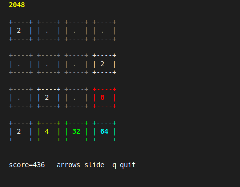 |
| Klondike solitaire | `examples/solitaire/console_solitaire.pas` (build with `-Fuexamples/solitaire_gui`, where its card engine lives; `./demos.sh` does this) | 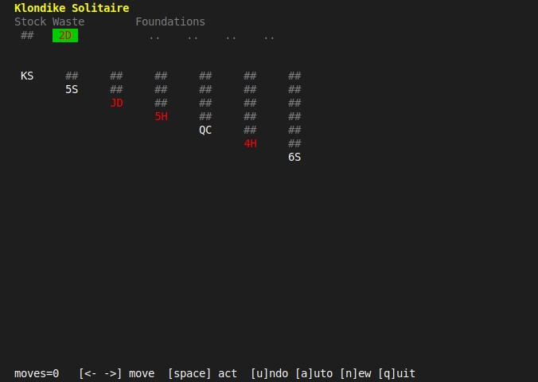 |
| Sudoku game | `examples/sudoku/sudoku_game.pas` | 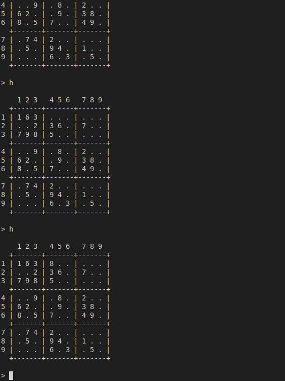 |
| Text adventure | `examples/adventure/adventure.pas` (run from `examples/adventure/`, it reads `world.dat`) | 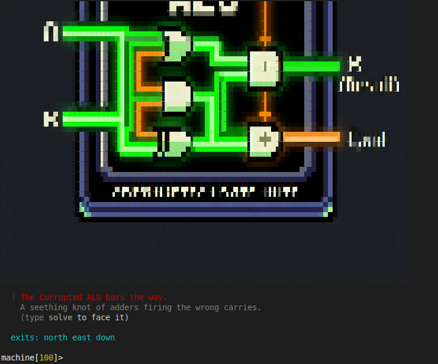 |
| Menu widgets | `examples/tui/menudemo.pas` | 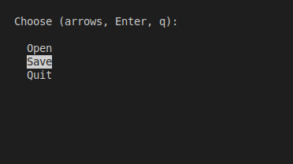 |
| File browser | `examples/fm/fm.pas` (`fm --interactive [path]`; with no flag it renders once and exits) | 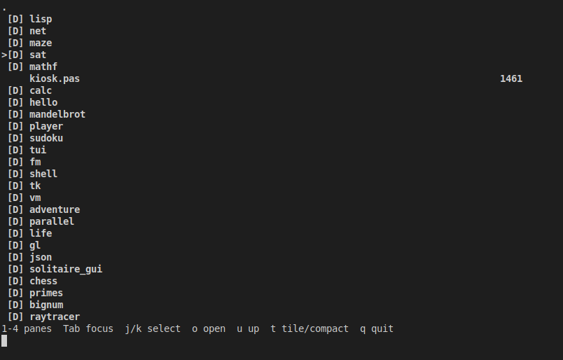 |
| Mandelbrot zoom | `examples/mandelbrot/mandelzoom.pas`: animated truecolor zoom using integer asm kernels on all cores (build with `--threadsafe`) | 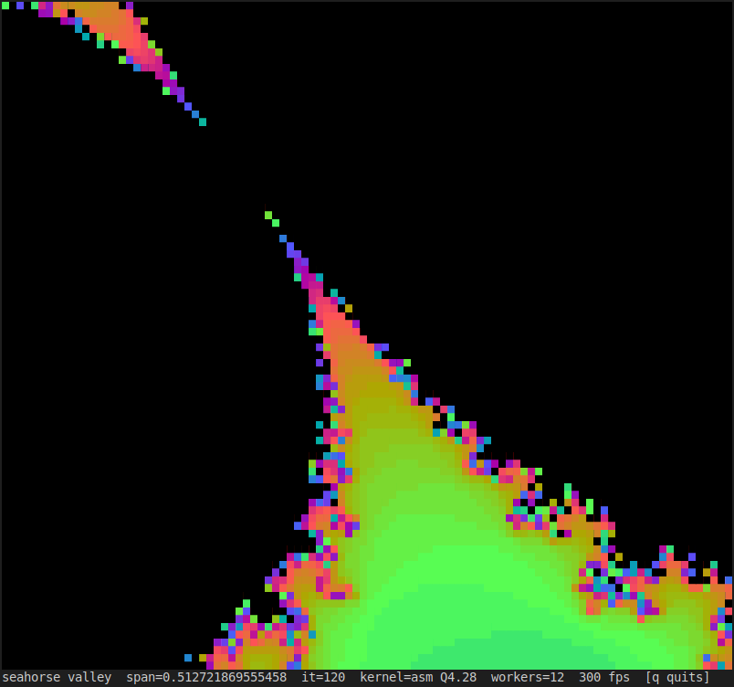 |
| Video player | `examples/player/player.pas`: `player <video>`, decodes through an `ffmpeg` child process and draws in truecolor blocks. Shown playing FFmpeg's `testsrc2` test pattern | 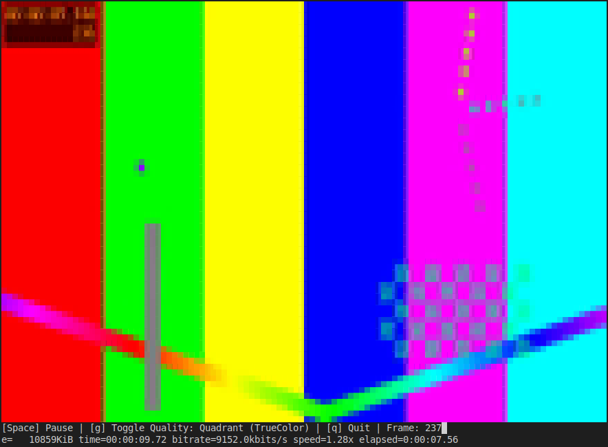 |

The chess engine (`examples/chess/chess.pas`) and the kiosk are
line-oriented, so they are shown as text. At start-up the engine prints the
board, its move-generation counts (perft), which match the published values
for the start position, and its opening choice. It then takes commands
(`print`, `fen`, `perft <n>`, `go <depth>`, `quit`):

```text
PXX chess demo

8  r n b q k b n r
7  p p p p p p p p
6  . . . . . . . .
5  . . . . . . . .
4  . . . . . . . .
3  . . . . . . . .
2  P P P P P P P P
1  R N B Q K B N R
   a b c d e f g h
White to move

perft(1) = 20
perft(2) = 400
perft(3) = 8902
perft(4) = 197281

bestmove e2e4  score 10  nodes 40793
chess> 
```

`examples/kiosk.pas` is the small program that runs inside the
[minimal Linux system](./minimal-linux-system.md):

```text
kiosk> about
pxx self-hosting Pascal compiler, static, no libc.
kiosk> sum 100
sum 1..100 = 5050
kiosk> primes 50
primes below 50 = 15
```

## Pascal: GUI applications

GTK 3 applications, two of them drawing with OpenGL. These need the GTK 3
development headers and libraries on the build host. The screenshots were
taken on a virtual X display with software OpenGL, so the render times and
frame rates shown inside them are not representative of a real GPU.

| Program | Source | |
| --- | --- | --- |
| OpenGL triangle | `examples/gl/triangle.pas` |  |
| Game of Life | `examples/life/life.pas` | 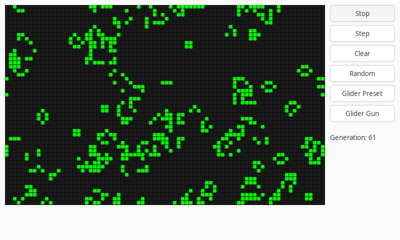 |
| Mandelbrot explorer | `examples/mandelbrot/mandelbrot_gui.pas`: drag to pan, click to zoom, rendered on every core | 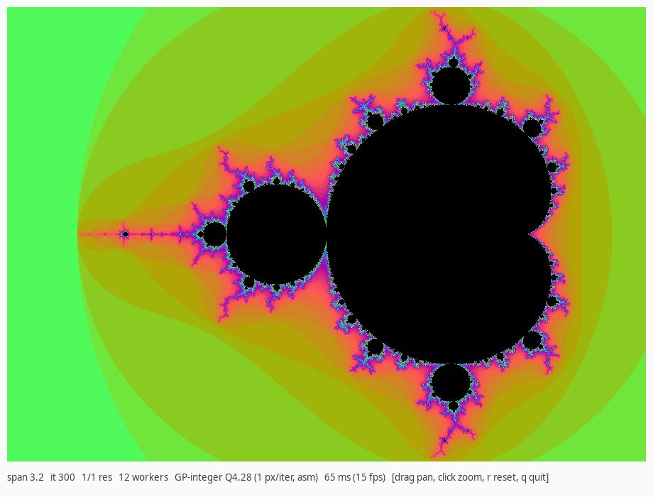 |
| Ray tracer | `examples/raytracer/raytracer_gui.pas`: reflective spheres, interactive camera | 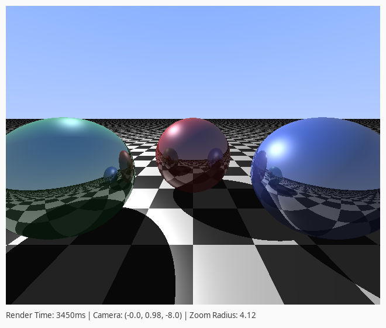 |
| Solitaire | `examples/solitaire_gui/solitaire_gui.pas` |  |

### The Eliah IDE

`apps/ide/` is a larger application built with PXX: a single-window IDE,
Lazarus- and Delphi-inspired but deliberately stripped down, with everything
tiled into one window. It is early work and the layout still shows it. It also
doubles as a real-world stress test for the compiler. It builds in about nine
seconds, and its headless core test reports `323 passed, 0 failed` with pin
v450. A second face for ESP32 boards, [the ESP32 IDE](../getting-started/esp-ide.md),
shares the same core.

```sh
apps/ide/build.sh       # builds apps/ide/eliah/eliah with the pinned compiler
apps/ide/test.sh        # the render-agnostic core, tested without any GUI
```

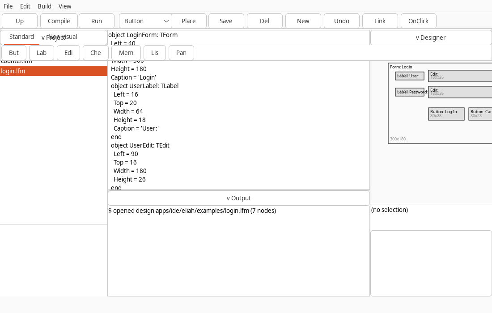

The components use a Hebrew naming scheme. Every name transliterates a word
tied to the prophet Elijah and the theme of testimony:

| Name | Hebrew | Meaning | Role |
| --- | --- | --- | --- |
| `garin` | גרעין | kernel / core | The render-agnostic engine: editor buffer, project model, the designed-form document and the builder. Both faces grow from this seed. |
| `eliah` | אליה | Elijah | The GTK face: the graphical IDE window. |
| `ilja` | איליה | Elijah | The ANSI/TUI face: the same prophet, a second face. |
| `bochan` | בוחן | examiner | The headless test driver for `garin`. It links no GUI or TUI face, which proves the core is render-agnostic. |
| `eduth` | עדות | testimony | The validator `bochan` reports to. It witnesses results, tallies pass and fail, and gives a verdict. |

## Python (NilPy)

NilPy is PXX's Python-shaped frontend. It compiles a static subset of Python
straight to machine code, with no interpreter at run time. Compatibility runs
one way: a program in the supported subset should give CPython's answers, and
NilPy also accepts some things CPython rejects. It is younger than the Pascal
frontend and has known gaps.

### nilsh: a BusyBox-style shell

`examples/shell/nilsh.npy` is a single binary whose commands are built-in
applet functions, with no fork and no exec. The same source is meant to run as
a Linux process or as an ESP32 task set. It plays a scripted session; the
block below is part of it, in order (the full session runs 15 commands):

```sh
./pxx examples/shell/nilsh.npy /tmp/nilsh && /tmp/nilsh
```

```text
$ help
applets: echo cat ls wc head tail grep upper rev help
$ echo one two three | wc
1 3 13
$ echo nilsh | upper
NILSH
$ echo nilsh | rev
hslin
$ echo alpha beta | cat | upper
ALPHA BETA
```

`examples/shell/shell0.npy` is the first phase of the same shell, kept as a
smaller example: tokenize, dispatch, applet, over a canned script.

### tkinter: GUI programs in Python

`examples/tk/` holds ten Nil Python programs written against PXX's `tkinter`
module (`lib/pcl/tkinter.pas`). It binds the system Tcl/Tk 8.6 directly, so it
needs `libtk8.6` at run time but no development headers. Widgets are objects
that take keyword options, as in CPython's tkinter. Underneath, each call is
one Tcl command. `examples/tk/hello.npy` and `widgets.npy` use the thinner
`tk.pas` layer directly.

```sh
./pxx examples/tk/widgets.npy /tmp/widgets && /tmp/widgets
```

| Program | What it shows |
| --- | --- |
| `hello.npy` | A window and a label through `tk.pas` |
| `widgets.npy` | ttk label, entry, text and button; reads each back |
| `tkinter_facade.npy` | Widget objects with keyword options, a `StringVar` |
| `callbacks.npy` | A bound method, a plain function and a lambda as commands; a variable trace |
| `kwargs.npy` | Keyword arguments bind by name, including `set`, `file`, `index` |
| `field_class_identity.npy` | A widget stored in a field keeps its class |
| `facade_and_paths.npy` | `tk.END`, a `Text` widget, `pathlib`-style paths |
| `import_in_body.npy` | `import` inside a function body |
| `shadow_format_except.npy` | A method calling the module function it shadows, `str.format`, a qualified `except` |
| `htmlview.npy` | `tkhtmlview`: HTML rendered into a Tk text widget, checked by reading the text back |

With pin v449 all ten built and ran under Xvfb. The three that ship a
`.expected` file (`callbacks`, `field_class_identity`, `tkinter_facade`)
matched it exactly, and the others printed their `ok` line. The programs close
their own windows within half a second, so a headless run ends by itself.
The folder's one Pascal file, `uses_tkinter_and_configparser.pas`, is a
regression program rather than a demo. It checks that the Tk `Text` widget
does not capture the RTL's `Text` file record, and prints `both ok`.

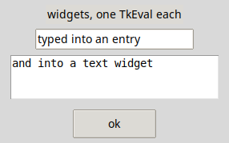

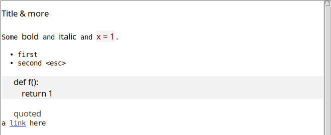

For these two screenshots the programs were held open longer. `widgets.npy`
closed after 5 seconds instead of 0.4. In `htmlview.npy` a `mainloop()` with a
5-second close timer replaced its read-back checks. Taken 2026-09-28 with pin
v449 on Xvfb, with no window manager, so the windows have no title bar.

### lekkerzeilen: a 3D sailing simulator

lekkerzeilen is a separate project: a boat simulator on the real Dutch rivers,
built from open elevation, building and waterway data and rendered with SDL2
and OpenGL. It is written in ordinary Python and runs under CPython through
`ctypes`. The **same source** compiles with PXX to a native binary that talks
to SDL2 and OpenGL directly. It compiles to about 11.6 MB of machine code with
one command, run from the PXX checkout with the lekkerzeilen checkout beside
it (lekkerzeilen's own `runbin.sh` does the same):

```sh
stable_linux_amd64/default/pinned --threadsafe \
    -dSDL_DISABLE_IMMINTRIN_H -dGL_GLEXT_PROTOTYPES \
    ../lekkerzeilen/lekkerzeilen/__main__.py ../lekkerzeilen/bin/lekkerzeilen
```

The binary looks for its `world/` data relative to its own location, so keep
it in the project's `bin/` directory.

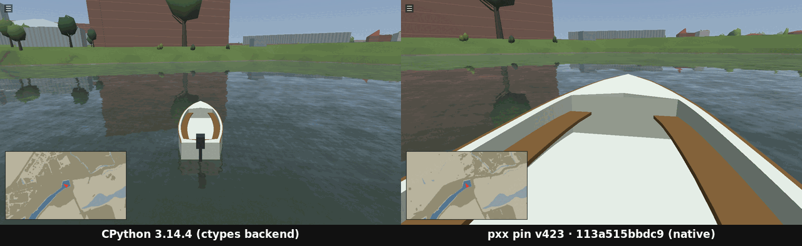

Both screenshots show the same built scene, the same launch and the same
1280×720 window. They were taken on 2026-09-24, from lekkerzeilen commit
`9db2e38` without changes, on the PXX side built with pin v423. Each is a
single frame captured shortly after start-up, which is why the camera views
differ.

**It compiles and runs. It is not yet as fast as CPython.** A frame rate there is
a property of the scene. The project's own measurement on the `world/roofs`
region (4 tiles), the scene the demo starts in, is **PXX 1.89 fps against
CPython 37.1 fps**: the median over 20-frame windows of 150-second runs, with
audio and vsync on, on one machine, one program at a time. Other scenes
behave very differently, and no other lekkerzeilen frame rate is current.
That measurement was taken by the
lekkerzeilen project on **pin v416**, not re-run for this page. That
measurement's own notes list compiler fixes that landed after v416, so a figure
from a later pin may differ. The gap is the work in progress; the result that stands is
that a large 3D Python application with sound builds into one native binary
and runs.

## ESP32

PXX cross-compiles to the ESP32-S3 (Xtensa LX7), the ESP32-C3 (RISC-V) and
the classic ESP32 (Xtensa LX6). The ESP32-S2 compiles, but nothing has run on
it. A program becomes a relocatable object that the normal ESP-IDF build links
as `app_main`. That includes a Python program, which becomes machine code on
the chip with no interpreter. The examples live in `examples/esp32/`, one
ESP-IDF project per program and chip, each with a `README.md` naming its chip
and language. To build and flash one yourself, follow
[Getting started on the ESP32](../getting-started/esp32.md); the units they use
are documented in [ESP32 peripherals](../library/esp.md). The per-chip
compiler details are in [ESP32 / Microcontrollers](../targets/esp32.md).

### All 36 ESP32 examples

"Board" is the most recent run on real silicon recorded on this page, and its
section below gives the compiler. "QEMU" is Espressif's emulator: it has no
ESP32-S2 machine, delivers no GPIO input edges, samples no real ADC and has no
Wi-Fi radio, so the rows that need those have no QEMU run. The four newest
classic-ESP32 ports ran on a board with pin v448; two of them fail there and
are kept as reproducers (see [On a classic ESP32](#on-a-classic-esp32)).

| Example | Chip | Language | What it does | QEMU, pin v449 | Board |
| --- | --- | --- | --- | --- | --- |
| hello-s3 | S3 | Pascal | Prints five lines and a sum | pass | S3, 2026-09-28 |
| hello-c3 | C3 | Pascal | The same, on RISC-V | pass | C3, 2026-09-28 |
| hello-esp32 | classic | Pascal | The same, on the LX6 | – | classic, 2026-09-27 |
| hello-s2 | S2 | Pascal | The same, for the S2 | – (no S2 machine) | not run: builds only |
| nilpy-s3 | S3 | Python | A class, a list, a loop, `print`; output equals CPython's | pass | S3, 2026-09-28 |
| nilpy-c3 | C3 | Python | The same source | pass | C3, 2026-09-28 |
| nilpy-esp32 | classic | Python | The same source | – | classic, 2026-09-27, and again with pin v448 |
| nilpy-hw-s3 | S3 | Python | Drives a GPIO pin; an ESP-IDF timer calls back into Python | pass | S3, 2026-09-28 |
| nilpy-hw-c3 | C3 | Python | The same source | pass | C3, 2026-09-28 |
| nilpy-hw-esp32 | classic | Python | The same source | – | classic, pin v448: **fails**, a watchdog reboot loop before its first line. A reproducer |
| timer-s3 | S3 | Pascal | A periodic `esptimer` callback, five ticks | pass | S3, 2026-09-28 |
| timer-c3 | C3 | Pascal | The same source | pass | C3, 2026-09-28 |
| timer-esp32 | classic | Pascal | The same source | – | classic, pin v448: matches `main.expected` |
| isrctx-c3 | C3 | Pascal | Interrupt context versus task context | pass | C3, 2026-09-28 |
| fs-c3 | C3 | Pascal | FAT on flash: write, seek, read back | pass | C3, 2026-09-28 |
| dns-c3 | C3 | Pascal | lwIP's resolver through `dns_libc` | pass | C3, 2026-09-28 |
| net-c3 | C3 | Pascal | Sockets on lwIP, over loopback | pass | C3, 2026-09-28 |
| gpio-c3 | C3 | Pascal | A probe: reads follow writes, pull-up, edges | pass | C3, 2026-09-28 |
| gpio-edge-s3 | S3 | Python | GPIO edge interrupts handled in Python | – (no input edges) | S3, 2026-09-28 |
| gpio-edge-c3 | C3 | Python | The same source | – (no input edges) | C3, 2026-09-28 |
| gpio-edge-esp32 | classic | Python | The same source | – (no input edges) | classic, pin v448: **fails**, the same reboot loop. A reproducer |
| adc-s3 | S3 | Python | Continuous ADC sampling, frames handled in Python | – (no ADC) | S3, 2026-09-28 |
| adc-c3 | C3 | Python | The same, plus pull-up and pull-down reads | – (no ADC) | C3, 2026-09-28 |
| monitor-s3 | S3 | Python | Sensor monitor: ADC, BOOT button, free heap | – (no ADC) | S3, 2026-09-28 |
| rgb-s3 | S3 | Pascal | Rainbow fade on the devkit's WS2812 LED, through RMT | – | S3, 2026-09-28 |
| pwm-s3 | S3 | Pascal | PWM, read back by the same chip | – | S3, 2026-09-28 |
| uart-s3 | S3 | Pascal | UART1 to its own receiver | – | S3, 2026-09-28 |
| uart-esp32 | classic | Pascal | The same source | – | classic, pin v448: **10 of 13 checks**; see below |
| i2c-s3 | S3 | Pascal | I2C with the second controller as the device | – | S3, 2026-09-28 (empty bus only) |
| spi-s3 | S3 | Pascal | SPI master, no device | – | S3, 2026-09-28 |
| nvs-s3 | S3 | Pascal | Settings that survive a reboot, over four boots | – (needs a reset) | S3, 2026-09-28 |
| wifi-ap-s3 | S3 | Pascal | Wi-Fi access point and a Pascal web server | – (no radio) | S3, 2026-09-28 (no client joined) |
| wifi-ap-c3 | C3 | Pascal | The same | – (no radio) | C3, 2026-09-28: an S3 joined and loaded the page |
| nilpy-station-s3 | S3 | Python | Access point and a status page, in Python | – (no radio) | S3, 2026-09-28 |
| nilpy-station-c3 | C3 | Python | The same source | – (no radio) | C3, 2026-09-28 |
| nilpy-logger-s3 | S3 | Python | MicroPython-style Wi-Fi data logger: setup AP, CSV on flash, HTTP | – (no radio) | S3, 2026-09-28 |

The same folder opens in [the ESP32 IDE](../getting-started/esp-ide.md)
(`./espide.sh`), which detects the chip and builds and flashes with one button:

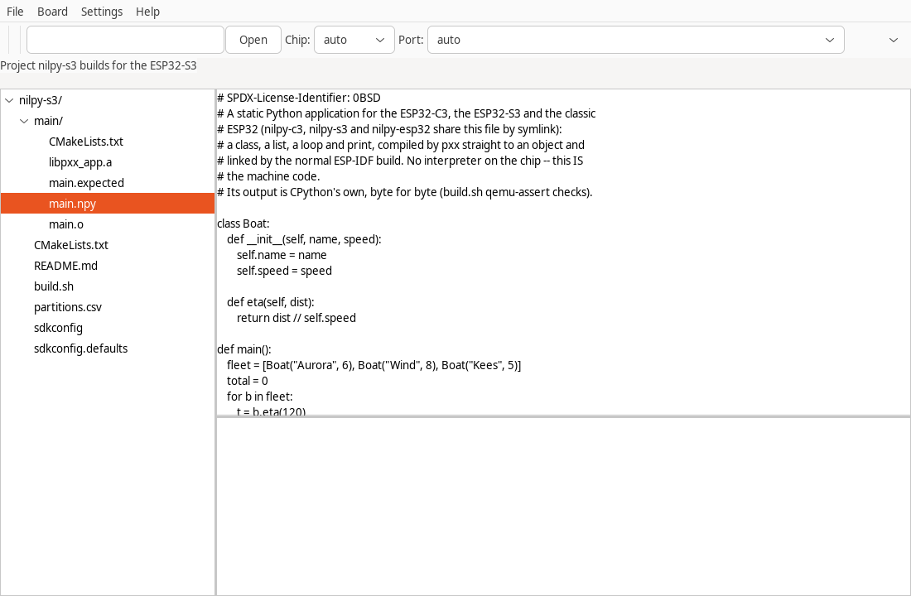

The IDE was built with pin v449 and captured on Xvfb on 2026-09-28. The rows
under the toolbar that name the host's ESP-IDF path and the serial numbers of
the attached boards were blanked in the image.

### A Python sensor monitor on an ESP32-S3

`examples/esp32/monitor-s3/main/main.npy` is a sensor monitor written in
Python and compiled to Xtensa machine code: there is no interpreter on the
chip. Once a second it:
- averages the ADC samples streamed in the background;
- keeps a short history in a list and its statistics in a dict;
- counts presses of the BOOT button;
- prints one line with the chip's own free heap.

The ADC and button interrupts are handled in Pascal (`espadc`, `espgpio`),
and the Python handlers run afterwards in the main task, so they are ordinary
code.

```python
import time
import interrupts
import 'espadc.pas' as adc
import 'espgpio.pas' as gpio
import 'espsys.pas' as sys

def on_button(ev):
    state["presses"] += 1
    print(f"button pressed ({state['presses']} so far)")

def main():
    interrupts.on_event(interrupts.INT_SRC_ADC, on_frame)
    interrupts.on_event(interrupts.INT_SRC_GPIO, on_button)
    gpio.gpio_input(BUTTON)
    gpio.on_falling(BUTTON)
    print("adc start", adc.start(ADC_CHANNEL, SAMPLE_HZ))
    for tick in range(1, REPORTS + 1):
        time.sleep(1)
        stats = summarize(collect())
        ...
        print(f"#{tick:3d} mean {stats['mean']:4d} range {stats['min']}..{stats['max']}"
              f" trend {trend:7s} frames {state['frames']} free {sys.free_heap()}")
```

Build and flash it with the ESP-IDF toolchain loaded
([Getting started on the ESP32](../getting-started/esp32.md) has the setup):

```sh
tools/esp_flash.sh --project examples/esp32/monitor-s3 --port /dev/ttyACM0 --no-verify --seconds 15
```

**The soak on the board.** It was run with `REPORTS` raised from 10 to 240 and
captured over serial for 262 seconds. It printed 193 reports, and the free heap
stayed between 257,948 and 262,072 bytes the whole time. It only switches
between those two values, depending on whether a buffer is in use at the
moment of the reading, and never drifts. These are the first reports as
captured, with nothing connected to the ADC pin, so the readings sit near the
top of the 12-bit range:

```text
I (523) main_task: Calling app_main()
adc start 0
#  1 mean 3861 range 3796..3882 trend flat    frames 16 free 258084
#  2 mean 3860 range 3836..3882 trend flat    frames 32 free 262068
#  3 mean 3859 range 3837..3879 trend flat    frames 48 free 262060
#  4 mean 3859 range 3838..3879 trend flat    frames 64 free 262068
#  5 mean 3859 range 3839..3878 trend flat    frames 80 free 262068
#  6 mean 3859 range 3839..3877 trend flat    frames 96 free 262072
#  7 mean 3859 range 3839..3878 trend flat    frames 112 free 257976
#  8 mean 3859 range 3837..3877 trend flat    frames 128 free 262056
#  9 mean 3860 range 3837..3880 trend flat    frames 144 free 262060
# 10 mean 3860 range 3839..3880 trend flat    frames 160 free 262060
```

The soak was measured on 2026-09-25 on an ESP32-S3 devkit (ESP-IDF v6.0.1,
160 MHz), with a compiler built after pin v424 (sha256 `29956ba5beff…`, tree
`9c14efd7b`). The checked-in example, with `REPORTS = 10`, also runs on the
board with pin v424 and with pin v425: on v425 its ten reports read an ADC mean
of 3861 to 3863 and free heap between 257,976 and 262,088 bytes. The raw
capture and the exact program are kept in the repository, in
[`devdocs/evidence/monitor-s3-soak-2026-09-25/`](https://github.com/yoctobyte/pxx/tree/master/devdocs/evidence/monitor-s3-soak-2026-09-25).

Nil Python is python-ish: this program stays inside the core that behaves as
CPython does, and outside it the language is known to have plenty of issues
(see [Nil Python](../targets/nil-python.md)).

### The other examples, under QEMU

For this page, each one below was **built with pin v441 and booted under
Espressif's QEMU** on 2026-09-27; all 13 runs (hello on both chips and the 11
projects) passed. Each was judged by the program's `main.expected` file or by
its own verdict line: `./build.sh qemu-assert` where the project has it, and
`./build.sh qemu` for dns-c3 and net-c3, whose `qemu` mode asserts. The v425
check on 2026-09-25 ran timer-s3, timer-c3, fs-c3 and gpio-c3 through the
interactive `./build.sh qemu`, which exited without a verdict, so **those four
were first actually judged with v441**. The table shows `qemu-assert` for them.
On 2026-09-28 all 13 passed again with pin v448 (sha256 `b2b325036c3b`), in a
fresh clone at `6b34caaf23`, run one at a time with the commands in the table.
These QEMU runs are separate from the board runs below. The C3 ones have
since run on a physical board too; see [On a real ESP32-C3](#on-a-real-esp32-c3).
The prerequisite is the ESP-IDF toolchain
(`. ~/esp/esp-idf/export.sh`).

| Example | Chip | Language | Command | Result |
| --- | --- | --- | --- | --- |
| hello | S3, C3 | Pascal | `tools/esp_run.sh --chip esp32s3 examples/esp32/hello-s3/main/main.pas` | prints its five lines and `sum 1..5 = 15` |
| nilpy-s3, nilpy-c3 | S3, C3 | Python | `cd examples/esp32/nilpy-s3 && ./build.sh qemu-assert` | output identical to CPython's |
| nilpy-hw-s3, nilpy-hw-c3 | S3, C3 | Python | `./build.sh qemu-assert` | GPIO and timer calls from Python match `main.expected` |
| isrctx-c3 | C3 | Pascal | `./build.sh qemu-assert` | task context and interrupt context both witnessed |
| timer-s3, timer-c3 | S3, C3 | Pascal | `./build.sh qemu-assert` | five ticks, `status=0` |
| fs-c3 | C3 | Pascal | `./build.sh qemu-assert` | FAT mount, write, seek and read back: `esp-pal-file-io-WORKS` |
| dns-c3 | C3 | Pascal | `./build.sh qemu` | lwIP resolver smoke test, `status=0` |
| net-c3 | C3 | Pascal | `./build.sh qemu` | network smoke test, `status=0` |
| gpio-c3 | C3 | Pascal | `./build.sh qemu-assert` | GPIO configuration runs. QEMU delivers no input edges, and the program reports exactly that |

`tools/esp_run.sh` compiles with the in-tree compiler unless
`ESP_RUN_PXX="$PWD/stable_linux_amd64/default/pinned"` is set. The script
compiles from inside the ESP-IDF project; since 2026-09-28 it resolves a
relative path against the directory you run it from, and an older copy needs
the path absolute, as here. The `build.sh` scripts default to the pinned
compiler.

The Python program from `nilpy-s3` is ordinary Python:

```python
class Boat:
    def __init__(self, name, speed):
        self.name = name
        self.speed = speed

    def eta(self, dist):
        return dist // self.speed

def main():
    fleet = [Boat("Aurora", 6), Boat("Wind", 8), Boat("Kees", 5)]
    total = 0
    for b in fleet:
        t = b.eta(120)
        total += t
        print(b.name, t)
    print("total", total, len(fleet))

main()
```

On the emulated ESP32-S3 it prints the same bytes CPython prints on a desktop:

```text
Aurora 20
Wind 15
Kees 24
total 59 3
```

### On a real ESP32-S3

The examples were flashed to an ESP32-S3 board on 2026-09-27 with pin v441,
the beta 0.1 compiler (ESP-IDF v6.0.1; the board is an ESP32-S3 rev v0.2, MAC
`50:78:7d:14:23:10`). Every row below passed. Earlier, on 2026-09-24/25, the
same examples had passed on an ESP32-S3 devkit with pin v424 and again with
pin v425. That record names fourteen checks (the twelve `-s3` examples in
the table other than `monitor-s3`, `spi-s3` and `nilpy-station-s3`, plus the
two short-form programs) and counts
them as fifteen. `spi-s3` had also run with v425, outside that list. The
details are in
[Getting started on the ESP32](../getting-started/esp32.md#verified-with).

On 2026-09-28 every row passed again on an ESP32-S3 behind a CH343 bridge,
with the compiler built from tree `cdd6fd3c1f` (sha256 `139494b2b863`; pin
v447 contains that tree), together with the newer `nilpy-logger-s3`, the
socket-error test and both short forms. Over a home Wi-Fi network the S3 also
made 300 `urequests` fetches and ran 300 `umqtt.simple` sessions without the
heap growing; the figures are in
[ESP networking](../reference/known-issues.md#esp-networking).

| Example | Language | Result on the board |
| --- | --- | --- |
| monitor-s3 | Python | with v441, its 10 reports: ADC mean 3856 to 3858, free heap 256,184 to 263,320 bytes; free heap flat over 193 reports with an earlier compiler (see above) |
| nilpy-s3, nilpy-hw-s3 | Python | output matches `main.expected` byte for byte |
| gpio-edge-s3 | Python | output matches `main.expected`: real input edges, which QEMU cannot deliver |
| adc-s3 | Python | output matches `main.expected`: real ADC readings |
| hello-s3, timer-s3, rgb-s3, i2c-s3, pwm-s3, uart-s3, spi-s3, nvs-s3 | Pascal | each prints its own pass line (`nvs-s3` over four boots, the last after a hardware reset) |
| wifi-ap-s3 | Pascal | starts the access point and reaches `HTTP server listening on port 80`; no client connected during the test |
| nilpy-logger-s3 | Python | its pass line, with the compiler from tree `cdd6fd3c1f` only (2026-09-28) |
| nilpy-station-s3 | Python | a Wi-Fi status page (`PXX-NILPY`, `http://192.168.4.1/`); all 12 lines of `main.expected`, including HTTP fetches of its own pages over `127.0.0.1`, on 2026-09-25 and again with v441. See [Wi-Fi and sockets](../library/esp.md) |

**Long-running use.** Re-run in a loop with v424, `nilpy-s3`, `nilpy-hw-s3`
and `gpio-edge-s3` lose about 44, 220 and 264 bytes per pass, and `adc-s3`
about 17 KB per pass, because an `adc.read()` whose result is thrown away is
not released. v425 carries the fixes for all of these. With a compiler that has
the first fixes (sha256 `29956ba5beff…`), the first three stay flat. With v425
itself, `adc-s3` looped 60 times keeps its free heap at 271,232 bytes from the
first pass to the last.

### On a real ESP32-C3

The C3 examples were flashed to one ESP32-C3 board on 2026-09-27 (chip
revision v0.4, 4 MB embedded flash, console on the built-in USB-Serial/JTAG
port, ESP-IDF v6.0.1), each with `tools/esp_flash.sh --project
examples/esp32/<name> --port <the board>`. Every one but `wifi-ap-c3` was
built with the release pin v441 (compiler sha256 `4ebfa2d047a2…`), from tree
`5db85cc283`. Nothing was wired to the board. On 2026-09-28 all of them
passed again with the compiler built from tree `cdd6fd3c1f` (sha256
`139494b2b863…`; pin v447 contains that tree), and `wifi-ap-c3`, new then,
was run with that compiler only.

| Example | On the C3 board | Compiler | Tree |
| --- | --- | --- | --- |
| hello-c3 | its five lines and `sum 1..5 = 15` | v441 `4ebfa2d047a2…` | `5db85cc283` |
| nilpy-c3, nilpy-hw-c3 | output matches `main.expected` byte for byte | v441 `4ebfa2d047a2…` | `5db85cc283` |
| adc-c3 | output matches `main.expected`: real ADC frames, pull-up reads high and pull-down low | v441 `4ebfa2d047a2…` | `5db85cc283` |
| gpio-edge-c3 | output matches `main.expected`: 10 real edges, all accounted for | v441 `4ebfa2d047a2…` | `5db85cc283` |
| timer-c3 | five ticks, `status=0` | v441 `4ebfa2d047a2…` | `5db85cc283` |
| isrctx-c3 | task and interrupt context both witnessed, `status=0` | v441 `4ebfa2d047a2…` | `5db85cc283` |
| fs-c3 | `esp-pal-file-io-WORKS` | v441 `4ebfa2d047a2…` | `5db85cc283` |
| net-c3 | loopback socket smoke test, `status=0` | v441 `4ebfa2d047a2…` | `5db85cc283` |
| dns-c3 | resolver smoke test, `status=0` | v441 `4ebfa2d047a2…` | `5db85cc283` |
| gpio-c3 | reads follow writes, the pull-up reads 1, and all 10 edges arrive, none of which QEMU models; the probe's verdict line still names QEMU | v441 `4ebfa2d047a2…` | `5db85cc283` |
| nilpy-station-c3 | all 12 lines of `main.expected`; a PC's Wi-Fi scan saw its `PXX-NILPY` network | v441 `4ebfa2d047a2…` | `5db85cc283` |
| wifi-ap-c3 | starts the access point `PXX-ESP32C3`; an ESP32-S3 joined it and loaded the page five times, all HTTP 200 (`test/esp_board_s3_visits_wifi_ap_c3.npy`) | after v446 `139494b2b863…` | `cdd6fd3c1f` |

**Long-running use.** The heap soaks were also run on this board, with pin
v441: `hello-c3` looped 100 times kept 0 bytes, and `nilpy-c3` kept 0 bytes
after 10, 160, 640 and 1280 passes. The positive control, a deliberate 64-byte
allocation per pass that is never freed, read 76 bytes per pass in both
(`tools/esp_heap_soak.sh`, `tools/esp_heap_soak_nilpy.sh`, with
`SOAK_PORT=<the board>`).

**Wi-Fi.** The C3 joined a home Wi-Fi network (WPA3) as a station with
`test/esp_board_wifi_sta_join.npy`, got an address in about 4 seconds, and
answered three HTTP requests from a PC on the same network. Over that network,
`urequests` fetched a page from the PC 1,000 times without the heap growing.
With `test/esp_board_c3_joins_s3.npy` the C3 also joined the access point of
an ESP32-S3 running `nilpy-station-s3`, read its status page and made 300 more
requests, again with no growth: two boards, both running compiled Nil Python.
The numbers are in [Wi-Fi and sockets](../library/esp.md).

Still unverified: `hello-s2`, which builds but has not been run.
`tools/esp_flash.sh --project examples/esp32/<name>` builds, flashes and checks
an example on a board.

### On a classic ESP32

`hello-esp32` (Pascal) and `nilpy-esp32` (Nil Python, the same program as
`nilpy-s3`) ran on an ESP32-D0WD-V3 board, the original dual-core LX6 part; the
record, with the compilers used, is in
[ESP32 / Microcontrollers](../targets/esp32.md).

On 2026-09-28 four more S3 and C3 examples were ported to the classic part,
each with the same source as its S3 or C3 original, and run on the same board
(no PSRAM, CP2102 bridge) with pin v448 (compiler sha256 `b2b325036c3b…`), one
boot each:

| Example | Language | On the classic ESP32 |
| --- | --- | --- |
| timer-esp32 | Pascal | Output matches `main.expected` byte for byte, 7 lines. The earlier classic timer run used `timer-s3`'s source and was checked against expected serial output by eye |
| uart-esp32 | Pascal | `passed=10 failed=3`. Loopback echo gives 12 bytes where 11 are expected and fast echo 18 where 17 are expected. Pad control gives 2 bytes where it requires 0. Pad control exists to show that pad echo's bytes crossed the GPIO matrix, so on this chip the pad-echo pass shows nothing. `uart-s3`, the same source, passes 13 of 13 on the S3 |
| nilpy-hw-esp32 | Python | **Fails.** The program never prints its first line; the chip resets in a `TG1WDT` watchdog loop |
| gpio-edge-esp32 | Python | **Fails** the same way |

**`nilpy-hw-esp32` and `gpio-edge-esp32` are reproducers of a known gap on the
classic ESP32, not working examples.** Both READMEs say so. Both programs
pass on real S3 and C3 silicon: the `nilpy-hw` source was run there with pin
v449 by the session that owns those boards, as recorded in
`devdocs/progress/LOGBOOK.md`. Both failures stop inside `_xt_context_save`
(the Xtensa windowed context save), so they appear to be one fault. On the
same board with the same v448 compiler, `nilpy-esp32` (Nil Python with no
hardware and no callback) passes, and so does `timer-esp32` (a callback into
Pascal). So Nil Python runs on this chip and callbacks run on it. The failures
need both together. What triggers it, GPIO specifically or any callback from C
into Nil Python, is not established yet. The Wi-Fi station example was not ported.

`nilpy-logger-s3` is a Wi-Fi data logger in the MicroPython style (a setup
access point, a saved network, a CSV log on flash, served over HTTP). Its board
run is the ESP32-S3 row above (2026-09-28).

## Real C programs

PXX's C frontend compiles third-party C as released, together with PXX's own
C runtime (`lib/crtl`) in place of glibc. There is one exception. zlib is
built as a single translation unit, where one anonymous `typedef struct` would
be repeated, and that is invalid C, which GCC rejects too. So the recipe gives
that struct a tag in a copy of `gzguts.h`. Apart from tcc, the results below
are static executables with no dynamic loader and no external C library. The
sources are fetched on demand, not stored in the repository:

```sh
tools/install_lib_candidates.sh busybox sqlite zlib lua cjson duktape quickjs tcc tiny-regex-c enet
```

That script fetches into a git checkout only. In a release archive, which is
not one, it stops with `library_candidates/ is NOT gitignored — refusing to
fetch`. For BusyBox the archive has its own route, in its `README.md` under
"Demo: build busybox with pxx": download `busybox-1.36.1.tar.bz2` from
busybox.net, then build it with `tools/busybox_diff.sh --build-only`. Run
from a fresh beta.1 archive, that built a 209,096-byte static
`busybox_x86_64` with `cat echo ls wc`, and `busybox_x86_64 echo hello`
printed `hello`. Configuring BusyBox's tree needs GCC on the host; the build
after that does not. The other libraries in the table have no archive route
yet: use a checkout.

Every row was re-run on 2026-09-29 with **pin v450** (compiler sha256
`c19cc2d531e4…`), from the v0.1.0-beta.1 release archive, with the library
sources taken from a checkout's `library_candidates/`. Every row gave the same
result as with pin v441 (commit `5c1696ca79`, sha256 `4ebfa2d047a2…`) on
2026-09-27. Each row says how it was checked: against the recipe's expected
output, against the same driver program built by GCC and linked with glibc, or
both. The binary sizes are for builds without `-g`, with v450, and a KB is
1,024 bytes and an MB 1,024 KB. The page used to give two sizes in units of
1,000, 171 KB for the BusyBox unity build and 4.9 MB for QuickJS; those two
binaries did not shrink. The BusyBox rows ran in the archive without
`--pinned`, because there `compiler/pascal26` is the v450 compiler.

| Program | Version | How it was checked | Binary |
| --- | --- | --- | --- |
| **BusyBox**, unity build | 1.36.1 | `tools/busybox_diff.sh --pinned --targets x86_64`: applets `cat` and `echo` as one translation unit; output byte-identical to a GCC build over 29 cases | 167 KB |
| **BusyBox**, linked by PXX itself | same | `tools/busybox_diff.sh --pinned --pxx-link --targets x86_64 --applets "cat echo ls wc sort ash"`: 55 objects linked by `pascal26 --link` with no external linker; no `PT_INTERP`; byte-identical to GCC over 82 cases | 20 MB |
| **SQLite** | 3.46.0 | amalgamation plus a ten-line `sqlite3_exec` driver; the SQL session below | 3.2 MB |
| **zlib** | 1.3.1 | zlib's own `test/example.c`: output byte-identical to the same program built by GCC | 717 KB |
| **Lua** | 5.4.7 | the six `test/lua/*.lua` programs: all match the expected output, and all six outputs are byte-identical to the GCC build; the stock `lua.c` interpreter also builds and runs | 984 KB |
| **cJSON** | 1.7.18 | the five `test/cjson/*.json` documents round-trip: all match the expected output and the GCC build | 149 KB |
| **Duktape** | 2.7.0 | a JavaScript engine: `test/duktape/duk_smoke.c` runs a curated script, exits 42, and prints 29 lines byte-identical to the expected output and to the GCC build | 1.4 MB |
| **QuickJS** (quickjs-ng) | 0.9.0 | `./pxx -Ilib/crtl/include -Ilib/crtl/src -Ilibrary_candidates/quickjs test/quickjs/runner.c qjs` (about 11 s), then `./qjs "$(cat test/quickjs/smoke.js)"`: output byte-identical to `test/quickjs/smoke.expected`. | 4.7 MB |
| **tcc**, the Tiny C Compiler | mob `a338258d` | from the repository root, `./pxx -Ilibrary_candidates/tcc library_candidates/tcc/tcc.c tcc`. That tcc compiles a C program into the same executable, byte for byte, as a GCC-built tcc does, and compiles `tcc.c` into a tcc byte-identical to the one the GCC-built tcc produces, which then reproduces itself. It uses tcc's own build tree for `config.h` and `libtcc1.a`. Unlike the other rows it links glibc's `libc.so.6` dynamically. `tcc -run` needs a different build; see [Status](../reference/status.md) | 1.8 MB |
| **tiny-regex-c** | `f2632c6d` | its own three test programs, each built together with `re.c`: `test1` passes 76 of 76, and all three print the same as the GCC build. `test1` counts its test table with `sizeof a / sizeof *a`, which v424 got wrong | 102 KB (`test1`) |
| **ENet**, reliable UDP networking | 1.3.18 | its eight Unix `.c` files (all but `win32.c`) built as one unit with a 50-line driver in which a server and a client, in one process, connect over `127.0.0.1` and send one reliable packet each way: `result: connected=1 server=1 client=1`, output identical to the GCC build | 196 KB |

SQLite, compiled by PXX from the single-file amalgamation:

```sh
./pxx -DSQLITE_THREADSAFE=0 -Ilib/crtl/include -Ilib/crtl/src -Ilibrary_candidates/sqlite driver.c /tmp/sqlmini
/tmp/sqlmini "create table boats(id integer primary key, name text, knots real);
  insert into boats(name, knots) values ('Aurora', 6.5), ('Wind', 8.0), ('Kees', NULL);
  select * from boats;
  select count(*), avg(knots), group_concat(name) from boats;
  select sqlite_version();"
```

```text
1|Aurora|6.5
2|Wind|8.0
3|Kees|NULL
3|7.25|Aurora,Wind,Kees
3.46.0
```

Here `driver.c` is `#include "sqlite3.c"` plus a `main` that opens `:memory:`
and passes its argument to `sqlite3_exec`. `-DSQLITE_THREADSAFE=0` builds SQLite
without its own locking, which a single-threaded program does not need. Without
it, SQLite's mutexes use `<pthread.h>` and the compiler asks for
`--threadsafe`. With v450, a `--threadsafe` build of the same driver, without
`-DSQLITE_THREADSAFE=0`, prints the same session, and is 3.3 MB. The draft pin
v425 hung in `sqlite3_open` there; the C runtime fix is `3f28aafab`.

zlib's own test program gives the same output as the GCC build, byte for byte:

```text
zlib version 1.3.1 = 0x1310, compile flags = 0xa9
uncompress(): hello, hello!
gzread(): hello, hello!
...
```

The repository's recipes for these are `make test-zlib`, `make test-lua`,
`make test-cjson` and `make test-duktape`. Those targets build with the in-tree
compiler rather than the pin; do not point their `COMPILER` variable at the
pinned binary, because the recipe then rebuilds that path.

## Real Pascal libraries

The Pascal rows above are PXX's own examples. These rows are third-party
Pascal, all from the Free Pascal 3.2.2 release, used as released. The sources
are fetched on demand:

```sh
tools/install_lib_candidates.sh fcl-json fpc-testsuite
```

Re-run on 2026-09-29 with **pin v450** (compiler sha256 `c19cc2d531e4…`),
from the v0.1.0-beta.1 release archive, with the sources from a checkout's
`library_candidates/`. Both rows gave the same result as with pin v425 on
2026-09-25.

| Program | Version | How it was checked | Binary |
| --- | --- | --- | --- |
| **fcl-json** (`fpjson`, `jsonparser`, `jsonscanner`) with the **fpcunit** test framework | FPC 3.2.2 release | fcl-json's own test suite, `tjrun.pp`: `run: 203 failures: 0 errors: 0`, the same result as the Free Pascal 3.2.2 build. One file is replaced: fpcunit's `testutils`, which reads Free Pascal's internal VMT layout, is swapped for `test/fpjson/testutils.pas`. Every other unit is used unmodified | 875 KB, static (v425: 870 KB) |
| **Free Pascal's own test suite** (`tests/test`) | FPC 3.2.2 release | `tools/run_pascal_conformance.sh`, on a curated 550 of the directory's 1,447 programs. Each must compile, run and exit as the test specifies, or be refused where the test expects a compile error. **427 pass, 0 fail.** 50 do not apply here (another CPU or target, or suite machinery PXX does not model). 73 are skipped, each with a written reason in `test/pascal-conformance/pxx.skip`: 39 are open gaps, 23 are deliberate differences, 9 wait on a design decision and 2 are programs PXX accepts where Free Pascal refuses them | – |

The fcl-json recipe is `make test-fpjson`, which uses the pinned compiler. The test-suite runner takes the compiler as its first argument: `tools/run_pascal_conformance.sh compiler/pascal26`. In a checkout, `compiler/pascal26` may be newer than the pin; pass `stable_linux_amd64/default/pinned` to measure the pin. In a release archive, `compiler/pascal26` is the pin. There `make test-fpjson` does not work with v0.1.0-beta.1: it looks for the compiler at a wrong path and reports a compile failure with 0 of 203 tests run. The v450 figure above came from the recipe's own steps, run by hand with `compiler/pascal26`.

## A bootable minimal Linux system

This isn't a program under `examples/`, but it is built from the checkout: a
BIOS and EFI ISO carrying a stock Linux kernel, a BusyBox shell compiled by
PXX and linked with no C library, and the PXX compiler itself, which compiles
and runs programs inside the guest. See
[A minimal Linux system](./minimal-linux-system.md) for the build, what it
does and does not establish, and its limits. It was not rebuilt for this page;
its build downloads a distribution kernel.

## Next

- [Getting started](../getting-started/)
- [Standard library](../library/)
- [Targets](../targets/)
- [A minimal Linux system](./minimal-linux-system.md)
