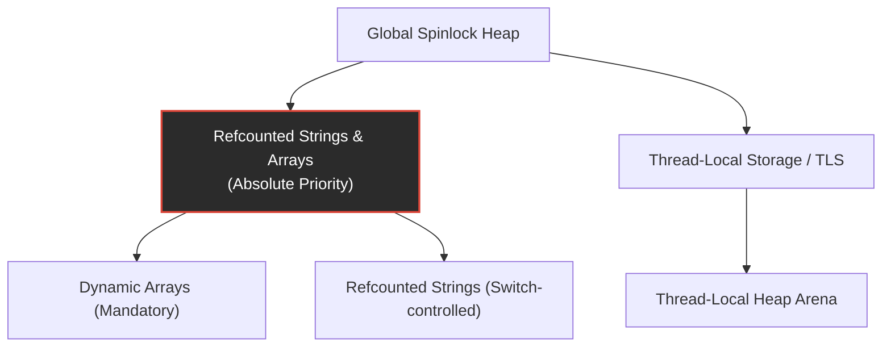

# Multithreading Roadmap & Design Todo

This document serves as a technical design specification and task roadmap for the continuation of the multithreading and thread-safety features in the Frankonpiler/PXX dialect.

---

## 1. Executive Status & Retrospective

We have successfully established the foundational multithreading architecture. Single-threaded programs continue to compile and run with zero overhead, while compiling with `--threadsafe` or `{$THREADSAFE ON}` correctly compiles concurrent code, self-hosts, and runs under FPC and self-hosted compiler pipelines without deadlocks or register corruption.

### Completed Milestones
* **Global Heap Lock**: Implemented a 32-bit user-space spinlock (`BSS_HEAP_LOCK`) using atomic `lock xchg` and `mov` instructions around all heap allocations, deallocations, and reallocations.
* **System V ABI Register Compliance**: Resolved a thread hang/deadlock by saving and restoring the callee-saved `%rbx` register inside the `GetMem` and `ReallocMem` inline blocks (`push %rbx` / `pop %rbx`).
* **General Type Alias Resolution**: Extended the parser to register non-pointer type aliases (e.g., `PthreadT = QWord`), resolving a truncation issue where 64-bit Thread IDs were corrupted during `pthread_join`.
* **Testing Infrastructure**: Integrated robust, concurrent thread-joining tests into all bootstrap verification stages in the `Makefile`.

---

## 2. Upcoming Roadmap & Technical Specifications



### Phase 1: Reference-Counted Strings & Dynamic Arrays (Absolute Priority)
Following our preprocessor stack allocation retrospective, implementing **dynamic, reference-counted strings (`AnsiString`) and dynamic arrays** has been elevated to the absolute top of the upcoming roadmap. 

By transitioning local string buffers from fixed-size call-stack allocations (which risk silently exceeding the 8 MB OS stack limit under deep recursion) to dynamically allocated, reference-counted heap pointers (just 8 bytes on the stack), we will permanently eliminate the danger of stack overflow and BSS memory corruption.

#### Implementation Steps:
1. **Reference Counting Compiler Pass**: Update the code generator (`ir_codegen.inc` and `symtab.inc`) to track string variable lifetimes and automatically insert atomic reference increments (`lock inc`) and decrements (`lock dec`).
2. **Copy-on-Write (COW) Semantics**: Add runtime helper routines to perform the "split" operation (duplicate buffer if refcount > 1) prior to any string modifications.
3. **Dynamic Heap Allocation**: Integrate string manipulation routines (`Concat`, `Insert`, etc.) directly with our thread-safe `GetMem`/`ReallocMem` heap allocator.

---

### Phase 2: Dynamic Arrays Atomic Locking
Dynamic arrays are reference-counted structures in the PXX dialect. Currently, reference increments and decrements are performed via standard memory modifications, which are unsafe under concurrent thread access.

#### Implementation Steps
1. **Locate Refcount Nodes**: Locate where reference counts are updated inside [ir_codegen.inc](file:///home/rene/frankonpiler/compiler/ir_codegen.inc).
2. **Inject Lock Prefixes**: In thread-safe mode, emit the x86-64 `lock` prefix (`$F0`) before reference increment and decrement instructions.
   > [!IMPORTANT]
   > On x86-64, only specific instructions (like `ADD`, `SUB`, `INC`, `DEC`) can be prefixed with `lock` when their destination operand is in memory.

---

### Phase 3: The String Reference-Counting Switch
Currently, strings in PXX are simplified, value-copied structures. If we implement reference-counted strings, they **must** be placed behind a compiler switch due to significant design trade-offs:

#### The String Reference-Counting Switch
We will introduce `{$REFCOUNTSTRINGS ON/OFF}` and the `--refcount-strings` command-line flag.

| Mode | Semantics | Performance Pros | Performance Cons |
| :--- | :--- | :--- | :--- |
| **Value-Copied (Default)** | Value semantics, deep copy on assign | Extremely fast local assignments, no locking overhead | High copy cost for very large strings |
| **Reference-Counted (Optional)** | Pointer semantics, shared buffers | Instant assignments (pointer copies) | Atomic refcount modification penalties, complex COW logic |

> [!NOTE]
> **Copy-On-Write (COW) Semantics:**
> When writing to a character index in a reference-counted string (e.g., `s[i] := 'a'`), the code generator must first check if the reference count is $> 1$. If so, it must allocate a new buffer, copy the string data (the "split" operation), decrement the old refcount, and only then perform the write. This prevents modifying other string variables sharing the same buffer.

---

### Phase 3: Thread-Local Storage (TLS) & Hybrid Allocator
To eliminate spinlock contention under highly concurrent allocation workloads, we can transition from a globally locked heap to a hybrid thread-local heap model.

```
+-------------------------------------------------------------+
|                     GLOBAL MMAP HEAP                        |
+-------------------------------------------------------------+
                               | (Grow Local Arena)
                               v
+------------------+  +------------------+  +------------------+
|  Thread 1 Heap   |  |  Thread 2 Heap   |  |  Thread 3 Heap   |
| (Lock-Free Bump) |  | (Lock-Free Bump) |  | (Lock-Free Bump) |
+------------------+  +------------------+  +------------------+
```

#### Architecture Design
* **Thread-Local Arena**: Each thread has a fast, lock-free bump-allocation pointer referencing a thread-local segment.
* **Segment Register access**: Thread-local heap pointers are accessed using the AMD64 `%fs` segment register (e.g. `%fs:0`).
* **Global Heap Fallback**: Large allocations or cross-thread memory deallocations fall back onto the globally synchronized heap.

---

### Phase 4: Threading Library Abstraction
Introduce native abstractions to insulate code from raw POSIX FFI:
* **TThread Class**: Provide a standard `TThread` class or a lightweight `beginthread`/`endthread` procedural wrapper.
* **Automatic Thread Cleanup**: Manage thread descriptors and resource reclamation natively upon termination.
